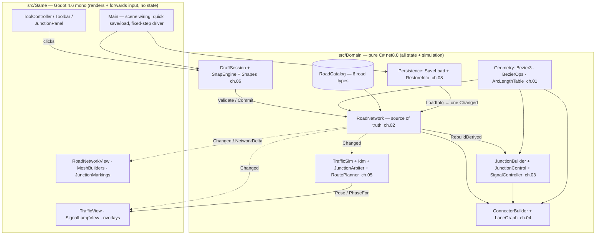

# 00 · Overview & Reading Guide

## What citybuilder is

citybuilder is a Cities: Skylines 2–inspired city builder in **Godot 4.6.2 (mono / C#)**,
built milestone by milestone toward a sellable game. The road network and its traffic
simulation are the foundation everything else grows on, and they are where essentially all
the complexity — and all of this manual — currently lives.

**What exists as of M6** (the milestone this manual documents, verified at commit
`f0542d7`, 2026-07-16):

- A **road-drawing editor**: six draft shapes (straight, quad/cubic curve, arc, chain,
  grid stamp), candidate-scored snapping, live validation with a ghost preview, and
  handle-drag editing of a rejected placement.
- A **road graph** of six road types (TwoLane, FourLane, Street, Avenue, OneWay,
  Asymmetric 2+1) with a strict `Validate`/`Commit` placement pipeline: crossings
  auto-split into junctions, node reuse/healing, sliver and sharp-angle guards.
- **Derived junction geometry and control**: per-leg cut points, carriageway polygons,
  corner zones; priority-signs / all-way-stop / traffic-lights control with a two-phase
  signal controller.
- A **lane graph**: turn-lane assignment, capacity-aware straight connectors, conflict
  points — the static world the sim drives on.
- A **deterministic microsimulation**: IDM car-following, MOBIL-lite lane changes, A*
  routing, and a conflict-point junction arbiter with gap-acceptance and deadlock
  recovery. Ambient traffic spawns and replans; trip stats feed KPI health reports.
- **Rendering** of all of the above (asphalt, markings, sidewalks, junction paint,
  props, instanced vehicles, signal lamps, debug overlays) and **persistence** (versioned
  JSON quick save/load with a byte-stable round-trip contract).
- A **quality stack**: a gesture fuzzer, network/sim invariant checkers, a KPI health
  harness, and screenshot/motion/UI test harnesses.

Not yet built: economy, zoning, buildings, agents with purpose beyond ambient driving,
pathfinding for anything but vehicles, and multiplayer. This manual is about the road and
traffic core because that is what the codebase is, today.

## Architecture in one picture

The cardinal rule is **domain purity**: `src/Domain` (net8.0, `System.Numerics`) holds the
entire game state and simulation and never references Godot. `src/Game` (Godot mono) only
renders domain state and forwards input back into it, holding no authoritative state of its
own. Tests (`tests/`, net10.0) exercise the domain headlessly.

### The Changed-event data flow

Every edit — a committed road, a bulldoze, a junction reconfigure, a quick-load — follows
the same five-step path, and understanding it explains most of the codebase:

1. **Draft** — `DraftSession` turns clicks into a `PlacementProposal` (ch. 06).
2. **Validate** — `RoadNetwork.Validate` dry-runs it against the current graph, pure and
   side-effect-free, returning errors + crossings + the network `Version` (ch. 02).
3. **Commit** — `RoadNetwork.Commit` replays that decision against the *live* network
   inside one batch: split at crossings, reuse/create nodes, wire lanes (ch. 02).
4. **Derived rebuild** — `EndBatch` calls `RebuildDerived` for every touched node:
   `JunctionBuilder` first (geometry, cut points), then `ConnectorBuilder` (lanes,
   connectors, conflicts) — order matters (ch. 03, ch. 04). `Version` bumps.
5. **View / sim resync** — one `Changed` event carrying one `NetworkDelta` fires. Views
   mark dirty and remesh at most once per frame (ch. 07); `TrafficSim.Sync` rebuilds its
   caches on the next tick and drops vehicles stranded on now-gone lanes (ch. 05).

The domain never calls into a view. Persistence reuses the exact same path — `RestoreInto`
tears down and rebuilds the whole graph inside one batch, so a quick-load looks to every
view like one very large delta and needs no view-side special case (ch. 07, ch. 08).

### Subsystem-by-subsystem

- **Geometry** (`src/Domain/Geometry`, ch. 01) — the dependency-free curve layer. Every
  edge, lane, and connector is one cubic `Bezier3`; this module answers where a point is,
  which way it faces, how far along in metres, where it crosses, and how tight it bends.
  Everything above bottoms out here.
- **Network & validation** (`src/Domain/Network/RoadNetwork*`, ch. 02) — the source of
  truth. Owns the node/edge dictionaries, id counters, and the `Changed` event; enforces
  the `Validate`/`Commit` contract; the catalog of six road types lives alongside it.
- **Junctions & control** (`JunctionBuilder`/`JunctionControl`/`SignalController`, ch. 03)
  — two independent problems: where asphalt stops (geometry, cut points, corner zones) and
  who yields to whom (control mode + per-leg roles + signal phases).
- **Lane graph & connectors** (`ConnectorBuilder`/`LaneGraph`, ch. 04) — turns lanes and
  cut points into the connector graph vehicles actually drive: turn-lane assignment,
  capacity-aware straights, conflict points. The most bug-scarred file in the domain.
- **Traffic sim** (`src/Domain/Traffic`, ch. 05) — the fixed-step deterministic
  microsim: IDM following, MOBIL-lite lane changes, A* routing, and the conflict-point
  junction arbiter that is M5's crown jewel.
- **Drafting & snapping** (`src/Domain/Tools`, ch. 06) — the pure-domain gesture state
  machine and scored snap resolver that produce the proposals `Validate`/`Commit` consume.
- **Rendering & markings** (`src/Game`, ch. 07) — the only Godot-aware layer: the resync
  pattern, lane-profile-driven meshes, junction paint, instanced vehicles, overlays.
- **Persistence** (`src/Domain/Persistence`, ch. 08) — versioned JSON DTOs, one
  validate-then-mutate entry point, the byte-stable round-trip contract.

## Reading guide

Read the one chapter matching your task; pull in the others it leans on.

| Your goal | Read, in order | Why |
|---|---|---|
| **Touch traffic behavior** (following, arbitration, routing) | 05 → 04 → 03 | The sim reads the connector graph (04) and the control stamps (03) as a pre-solved world. |
| **Add or change a road type** | 02 → 04 → 07 | The catalog and lane specs live in 02; 04 turns lane specs into connectors; 07 renders the new profile. Watch direction-asymmetric types everywhere. |
| **Change junction geometry or control** | 03 → 04 → 07 | Geometry (03) feeds cut points to connectors (04) and polygons to rendering (07). |
| **Touch curve math** | 01 → then 02/04/05 (its callers) | 01 is dependency-free; a sampling blind spot here surfaces as a bug in a higher layer. |
| **Change the editor / snapping / tools** | 06 → 02 → 01 | 06 produces proposals; every numeric guard lives in 02; curve construction in 01. |
| **Touch rendering** | 07 → 03 → 04 | Views resync from `Changed`; junction meshes come from 03, turn arrows from 04. |
| **Change save format** | 08 → 02 | The DTO stores only what can't be rebuilt; everything else `RebuildDerived` regenerates. |
| **Understand the whole edit path** | 06 → 02 → 03 → 04 → 07 | Follows one click from gesture to painted junction. |

New to the codebase? Read **02** (the source of truth and its contract), then **05** (the
subsystem with the most behavior), then **04** (the trickiest algorithm) — in that order.

## Conventions

Compiled from the chapters and [docs/conventions.md](../conventions.md). Internalize these
before touching the domain:

- **Traffic frame.** XZ ground plane, +Y up, 1 unit = 1 metre, right-hand traffic. Lane
  offset > 0 = the driver's right when travelling Forward (P0→P3). `Bezier3.NormalXZ` is
  the single source of truth for this sign — flip it and every lane in the game swaps
  sides (ch. 01).
- **Direction-aware signed-offset lane ordering.** Rank lanes left→right by *signed*
  `Offset` (Forward ascending, Backward descending), **never** `|Offset|` — direction-
  asymmetric types (OneWay, Asymmetric) put driving lanes on the same side of centerline.
  This exact bug class recurs in `ConnectorBuilder` ranking and `TrafficSim` adjacency and
  is the codebase's single most common edge-case source (ch. 04, ch. 05, `gotchas.md`).
- **Ids as the only cross-layer reference.** `NodeId`/`EdgeId`/`LaneId` are opaque, never
  reused after removal. `src/Game` and persistence key everything by id and re-look-up the
  domain struct — never cache a `RoadEdge`/`RoadNode` across a rebuild (ch. 02, ch. 07).
- **Determinism by seed.** The sim's only randomness is a seeded `Random`; acceleration is
  computed for all vehicles before any position updates (simultaneous update). Same seed +
  same tick/spawn sequence + same network = identical run — the basis of every harness
  (ch. 05).
- **The fixture-repair rule.** When a fuzzer or invariant finds a bug, fix it at the root
  in domain code, then pin the exact seed + action count forever in `FuzzRegressionTests.cs`
  with a comment naming the root cause — so the scenario stays covered even after the
  default seeds change (`verification.md`, ch. 01/02).
- **Verify before done.** Nothing is "done" until verified with the harness matching the
  change: `dotnet test`, then `dotnet build citybuilder.sln`, then the smoke/screenshot/
  motion harness that fits. Evidence before claims (`verification.md`).

## Quality stack — how a new hire verifies anything they change

The manual documents behavior; these tools prove it. Full mechanics in
[docs/verification.md](../verification.md).

- **`dotnet test`** — the domain unit suite plus the default fuzz sweep (3 seeds × 300
  actions). This is the first gate for any domain change.
- **Gesture fuzzer** (`tests/Domain.Tests/Fuzzing/`) — drives the real editor surface
  headlessly, checking `NetworkInvariants.Check` after every action, `SimInvariants.CheckBurst`
  every 25, and a `SaveLoad` byte-equal round-trip every 10. Certification sweep
  (`CITYBUILDER_FUZZ_ACTIONS=10000`) runs once per milestone.
- **`NetworkInvariants` / `SimInvariants`** — independent post-state auditors you can call
  on any network/sim state (procedural, fuzzed, deserialized) for a flat violation list.
  Extend them whenever the editor surface or the invariants they should hold grow.
- **KPI / health reports** — `KpiSuiteTests.GenerateHealthReport` regenerates
  [docs/health/M6.md](../health/M6.md) and asserts non-perf metrics stay within ±25% of
  the baseline and perf under hard ceilings. Regenerate at the end of a milestone.
- **Screenshot / motion / UI / smoke harnesses** — for anything Godot-typed (out of
  `dotnet test`'s reach): `CITYBUILDER_SHOTS`, motion filmstrips + trail composites,
  `CITYBUILDER_UITEST`, `CITYBUILDER_SMOKE`. Read the PNGs; don't just check they exist.

Each chapter's **How to verify** section names the exact tests and harness for that
subsystem — start there.

## Known issues & open questions

Every `[UNCERTAIN]` flag and notable known limit surfaced by the chapters, in one scannable
list. `[UNCERTAIN]` items are unresolved-from-reading questions (a future contributor
should confirm against a running system); "limit" items are known, accepted scope cuts or
model ceilings.

Geometry (ch. 01):
- `[UNCERTAIN]` `SelfIntersects` false-positive root cause not traced at the float level.
  ([01 · Known limits](01-geometry.md#known-limits))
- `[UNCERTAIN]` Whether `SelfIntersects`' fixed 32-span grid can hide a self-crossing loop
  on a long curve (same shape as the M6 `MinRadius` bug). ([01](01-geometry.md#known-limits))
- `[UNCERTAIN]` Why `ArcFromTangent`'s sweep cap is 175° specifically. ([01](01-geometry.md#known-limits))
- Limit: `GeoConstants.MinEdgeLength` (4 m) is effectively dead code — only a smoke test
  pins it; per-type `MinSegmentLength` is the real floor.

Network & validation (ch. 02):
- `TryHealNode` can silently reverse a one-way road when a bulldoze heals a degree-2
  node — no direction-continuity check, HashSet-order-dependent orientation (M6
  final-review find, top M7 bug; [ch. 02 Known limits](02-network-validation.md#known-limits)).
- `[UNCERTAIN]` `TryHealNode` has no post-merge `MinSegmentLength`/`MinRadius` recheck after
  `CurveFit.FitComposite` — a possible latent gap, no repro found by reading.
  ([02 · Known limits](02-network-validation.md#known-limits))
- `[UNCERTAIN]` Whether a larger road-type catalog is planned (`RoadCatalog.Get` is a
  linear scan — fine at 6). ([02](02-network-validation.md#known-limits))
- Limit: `DroppedSegments` is a count, not a location. The Validate-snapshot-vs-Commit-live
  divergence is inherent to the two-phase design.

Junctions & control (ch. 03):
- `[UNCERTAIN]` `SignalController`'s leg-partition search has no test coverage for non-4-way
  lights nodes (3-way, 5-way). ([03 · Known limits](03-junctions-control.md#known-limits))
- Limits: no protected left-turn phases; no junction merging; no signal-timing authoring UI
  (green/amber/all-red are compile-time constants).

Lane graph & connectors (ch. 04):
- `[UNCERTAIN]` No dedicated fixture exercises the multi-target (fork/wye) branch of the
  per-target capacity cap in isolation. ([04 · Known limits](04-lane-graph-connectors.md#known-limits))
- Limit: the never-strand fallback picks the nearest departure with no turn-quality
  awareness; `CheckStraightCapacity`'s formula is deliberately coupled to `ConnectorBuilder`'s
  drop logic and must change with it.

Traffic sim (ch. 05):
- `[UNCERTAIN]` `TrafficSim.LookAheadHorizon` (120 m) is declared but read nowhere in the
  domain — confirmed not in `src/Game` either; likely dead/reserved. ([05 · Known limits](05-traffic-sim.md#known-limits))
- `[UNCERTAIN]` Merge-conflict tail blind spot: a rival mid-lane-change onto a conflicting
  connector's feeding lane may slip past both the approach scan and the passed-point rule.
  ([05](05-traffic-sim.md#known-limits))
- Limits: protected lefts deferred; a ~3.5 s saturation-headway discharge ceiling (a real
  model limit, tracked as a post-M6 driver-model tuning item — see ch. 03); failsafe-induced
  stops can be under-counted by the `Stops` counter.

Drafting & snapping (ch. 06):
- `[UNCERTAIN]` Whether `WeightGuideline == WeightGridPoint == 1.5` is intentional or
  coincidental (no comment either way). ([06 · Snapping](06-drafting-snapping.md#snapping))
- Limits: no G1 lock starting on a multi-edge junction node; parallel guides need both the
  `Guidelines` and `Parallel` flags; several cited game-layer items (numpad-Enter,
  red radius readout) not independently verified in the domain scope.

Rendering & markings (ch. 07):
- `[UNCERTAIN]` Whether current traffic densities can hit `TrafficView`'s silent
  1024-vehicle MultiMesh cap. ([07 · Known limits](07-rendering-markings.md#known-limits))
- Open: `TightCuts`' consumer was not found in the domain (ch. 03 flagged it as a likely
  `src/Game` concern or not-yet-wired); `SetEdgeTint`/`ClearTints` (speed heatmap) has no
  in-game UI action calling it yet; `AddCornerContinuation` bails on a type transition at a
  degree-2 corner; `JunctionProps` are placeholder procedural meshes.

Persistence (ch. 08):
- Limits: no save-format migration path (only version `1` has ever shipped); a single fixed
  quick-save slot; the `CITYBUILDER_UITEST` harness clobbers the player's real quick-save
  slot; vehicles/trips are unsaved (a deliberate v1 scope cut). ([08 · Known limits](08-persistence.md#known-limits))
- `[UNCERTAIN]`/latent: `ValidateGame` bounds entity ids against the counters but never the
  counters themselves — a hand-crafted negative-counter payload would validate and later
  mint an invalid id. No test exercises it (the fuzzer only produces positive counters).

Cross-cutting doc drift:
- **[docs/architecture.md](../architecture.md) lists only four road types** (TwoLane,
  FourLane, Street, Avenue). The code and this manual have **six** — OneWay and the
  Asymmetric 2+1 were added in M5. Trust the chapters/catalog; `architecture.md`'s catalog
  line predates M5 and should be refreshed.

## Not documented (skip list)

Deliberately out of scope, from the outline. These are omitted because they are build
artifacts, standard engine plumbing, or already covered elsewhere — not because they were
overlooked.

| Component | Why skipped |
|---|---|
| `src/*/obj/` generated files | Build artifacts. |
| Per-file `tests/` coverage | Tests are cited as verification pointers inside each chapter's *How to verify*, not chaptered on their own. |
| `src/Game/VisualShots.cs` internals | Screenshot/motion test harness; covered by [docs/verification.md](../verification.md), referenced from ch. 07. |
| Godot project plumbing (`project.godot`, scenes) | Standard engine configuration. |
| `src/Game` UI internals (`ToolController`, `Toolbar`, `JunctionPanel` input logic) | The gesture *domain* is ch. 06; the Godot input-forwarding shell is thin and standard, noted where views touch it in ch. 07. |
| Economy, zoning, buildings, non-vehicle agents | Not built yet as of M6 — nothing to document. |

---

*Front matter for the citybuilder living manual. Verified at `f0542d7`, 2026-07-16. See
[README.md](README.md) for the table of contents and how this manual stays current.*
