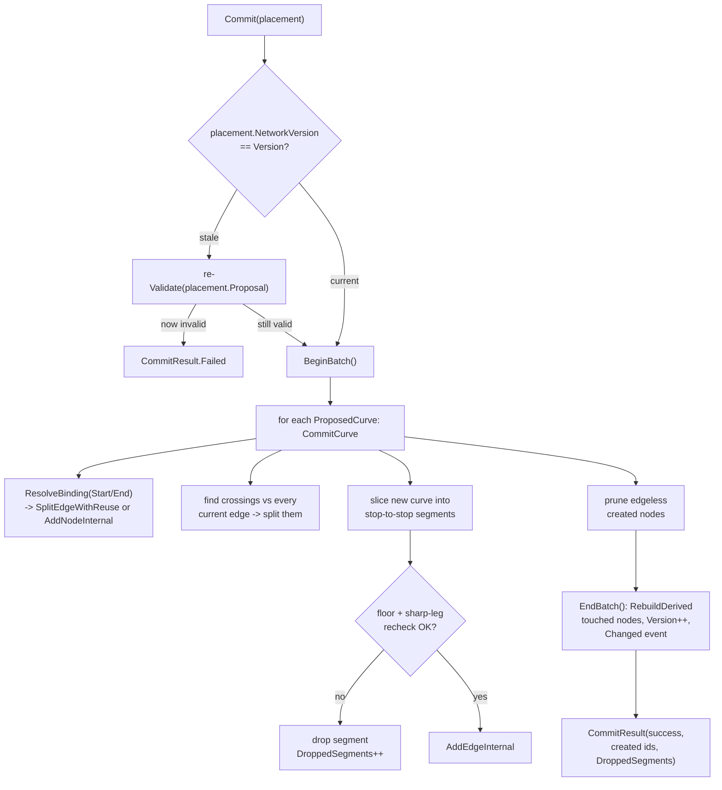

# Chapter 02 — Network & Validation

`RoadNetwork` is the domain's source of truth for the road graph, and it is the only
place the game's road tools are allowed to mutate it. Everything downstream — junction
geometry, lane connectors, traffic routing, rendering — is *derived* from the graph this
module owns, so its central job is not drawing curves, it's refusing to accept curves
that would leave the graph in an inconsistent state: overlapping asphalt, slivers too
short to be a real segment, junction legs meeting at angles no vehicle could actually
turn through. The module is built around a strict two-phase contract — `Validate` is a
pure, side-effect-free dry run against a proposal; `Commit` replays that decision against
the *current* live network and performs the actual graph surgery (splitting edges at
crossings, reusing or creating nodes, wiring up lanes). Nothing else in the codebase
edits `_nodes`/`_edges` directly.

## At a glance

- **Sources:** `src/Domain/Network/RoadNetwork.cs`, `Entities.cs`, `Ids.cs`,
  `CurveFit.cs`, `NetworkInvariants.cs`; `src/Domain/Catalog/RoadType.cs`;
  proposal/result types in `src/Domain/Tools/PlacementProposal.cs`.
- **Key types:**
  - `NodeId`/`EdgeId`/`LaneId`/`RoadTypeId` — opaque int wrappers (`Ids.cs:3-6`), never
    reused after removal (`RoadNetwork.cs:31`, monotonic `_nextNode`/`_nextEdge`/`_nextLane`).
  - `RoadNode` (`Entities.cs:6-27`) — position, `EdgeSet` of incident edges, and three
    pieces of *derived* state (`JunctionConfig`, `JunctionGeometry`, lane
    `Connectors`/`ConnectorConflicts`) that `RebuildDerived` regenerates whenever the
    node is touched.
  - `RoadEdge` (`Entities.cs:29-50`) — one immutable `Bezier3` plus its `ArcLengthTable`
    and the `Lane[]` the catalog spec produced for it.
  - `Lane` (`Entities.cs:52-70`) — offset/direction/width/kind; belongs to exactly one
    edge.
  - `RoadNetwork` (`RoadNetwork.cs:15`) — owns the `Dictionary<NodeId,RoadNode>` /
    `Dictionary<EdgeId,RoadEdge>`, the id counters, and the `Changed` event.
- **Used by:** the drafting tools (`src/Domain/Tools/DraftSession.cs` — not in this
  chapter's scope, see ch. 06) call `Validate` continuously for ghost/preview feedback
  and `Commit` once on confirm (see [ch. 06](06-drafting-snapping.md)); `RoadNetworkView` in `src/Game` subscribes to `Changed`
  to rebuild meshes.
- **Depends on:** `Bezier3`/`BezierOps`/`ArcLengthTable` ([ch. 01](01-geometry.md)) for curve math,
  `RoadCatalog` (this chapter) for per-type floors, `JunctionBuilder`/`ConnectorBuilder`
  ([ch. 03](03-junctions-control.md)/[04](04-lane-graph-connectors.md), invoked from `RebuildDerived`, `RoadNetwork.cs:715-721`).
- **Last verified against commit:** `f0542d7`, 2026-07-16.

## The road-type catalog

`RoadType` (`RoadType.cs:10-53`) is pure data — a width, a list of `LaneSpec`s, a design
speed, and a minimum curve radius — plus a handful of derived properties computed from
that list. `RoadCatalog` (`RoadType.cs:55-137`) hard-codes six types as `static
readonly` fields; there is no runtime type registration, so adding a new road type means
editing this file and rebuilding. `RoadCatalog.Get(RoadTypeId)` is a linear scan over
`All` (`RoadType.cs:134-136`) — fine at six entries, worth remembering if that list ever
grows into the hundreds.

Two derived floors matter everywhere in this chapter:

- `MinSegmentLength => Max(8f, Width)` (`RoadType.cs:19`) — the shortest edge of this
  type `Validate`/`Commit` will ever build, and also the **node-reuse absorption
  distance**: `SplitEdgeWithReuse` snaps a split point to an existing end node instead of
  actually splitting whenever it lands within this distance of that end
  (`RoadNetwork.cs:521-526`). That means a wide road type has a *wide* reuse radius —
  entirely separate from the small, fixed `NodeReuseRadius` used for endpoint-to-node
  snapping.
- `MinRadius` — a hand-tuned per-type curvature floor, independent of width.

| Type | Width | Lanes (offset, dir, width, kind) | Speed | MinSegLen | MinRadius |
|---|---|---|---|---|---|
| `TwoLane` (id 1) | 8 m | +1.75 Fwd / −1.75 Bwd, 3.5 m driving | 80 km/h | 8 m | 20 m |
| `FourLane` (id 2) | 16 m | ±1.75, ±5.25 (2 Fwd / 2 Bwd), 3.5 m driving | 100 km/h | 16 m | 35 m |
| `Street` (id 3) | 12 m | ±1.75 driving (3.5 m) + ±4.75 sidewalk (2.5 m) | 50 km/h | 12 m | 10 m |
| `Avenue` (id 4) | 21 m | ±1.75/±5.25 driving, ±7.75 bicycle (1.5 m), ±9.5 sidewalk (2 m) | 60 km/h | 21 m | 25 m |
| `OneWay` (id 5) | 12 m | −1.75 & +1.75 **both Forward** (3.5 m) + ±4.75 sidewalk | 50 km/h | 12 m | 10 m |
| `Asymmetric` (id 6, "2+1") | 12 m | −4.25 Bwd, −0.75 Fwd, +2.75 Fwd (3.5 m each) | 60 km/h | 12 m | 20 m |

`OneWay` (`RoadType.cs:109-118`) puts two lanes at *opposite-sign* offsets but the same
`LaneDirection.Forward` — the offset sign is purely geometric (which side of centerline),
so a one-way road's two lanes straddle the centerline exactly like a two-way road's
would, they just both carry traffic the same way. `Asymmetric` (`RoadType.cs:122-130`)
is the 2+1 rural cross-section: one lane one direction, two the other, and the comment
at `RoadType.cs:120-121` flags that the *painted* opposing line sits at −2.5 m — the
boundary between the single backward lane and the double-forward lanes — not at the
edge's geometric offset 0. `RoadType.IsDirectionAsymmetric` (`RoadType.cs:52`,
`ForwardCount != BackwardCount`) is true for exactly these two types and exists so the
renderer knows to paint directional arrows on the ghost/road surface — travel direction
isn't inferable from a symmetric lane layout the way it is here.

`CarriagewayHalf` (`RoadType.cs:21-32`) and `OuterHalf` (`RoadType.cs:42-47`) are the two
widths junction geometry cares about (ch. 03): the paved half-width up to the sidewalks'
inner edge, versus the full built half-width including sidewalks. `SpeedLimit`
(`RoadType.cs:37`) converts `DesignSpeedKmh` to m/s once, for the traffic sim ([ch. 05](05-traffic-sim.md)).

## How commits work

The pipeline is strictly two phases. `Validate(PlacementProposal)` (`RoadNetwork.cs:69-173`)
never touches `_nodes`/`_edges` — it only reads them — and returns a `ValidatedPlacement`
carrying the errors found, the crossing points (for the ghost preview), and the
`Version` the network was at when checked. `Commit(ValidatedPlacement)`
(`RoadNetwork.cs:346-378`) is the only method that mutates the graph for a placement.

**Validate's rules**, per proposed curve (`RoadNetwork.cs:78-148`): clear the type's
`MinSegmentLength`/`MinRadius`; no self-intersection (`BezierOps.SelfIntersects`); no
running parallel-and-close to an existing edge (`OverlapsExisting`, sampling 32 points,
flagged if a majority sit within `(halfNew+halfOld)*0.8` of another edge with
near-parallel tangent, `RoadNetwork.cs:316-342`); every crossing against an existing edge
must clear `MinJunctionAngleDeg` (25°, `:23`) — a crossing *is* a future junction, held to
the junction floor, not a looser "crossing" threshold; and a crossing must not land close
enough to an existing edge's own end to sliver *that* edge, unless it's within
`NodeReuseRadius` (0.5 m, `:18`) of the end, read there as connecting to the node
already there rather than splitting. Consecutive stops along one curve, and consecutive
crossings landing on the *same* existing edge from different curves of a multi-curve
proposal (`hitsPerExistingEdge`, `:150-165`), must also clear `MinSegmentLength` apart —
this closes a gap where a 2×2 grid stamp over a diagonal used to manufacture 4-5.6 m
slivers because each grid line was checked against the diagonal in isolation
(`PlacementTests.cs:328-336`). Endpoint bindings get the same sliver treatment
(`BindingLeavesSliver`, `:175-202`): a `Free` endpoint is checked *as if* resolved the way
`Commit` would resolve it, so it can't dodge validation by never naming the edge it's
actually going to land on.

Sharp-angle checking (`HasSharpLeg`/`ExistingLegDirections`, `:229-274`) compares the new
curve's departure direction against every existing leg at the attaching node or edge
point, with one exemption: **`TangentContinuationDeg`** (1°, `:27`). A curve starting
from an `OnEdge` binding within 1° of that edge's own tangent is a G1 continuation — a
ramp tangentially extending an existing road — exempt from the 25° floor. This applies
**only to `OnEdge`/mid-edge departures** (`fromEdge` flag, `:236`); an `AtNode` departure
at the same near-zero angle still flags, because doubling back over a leg at a node is
never legitimate the way a tangential mid-edge ramp is
(`PlacementTests.NearTangentialDepartureAtNodeStaysBlocked`).

**The commit-side guards — why they exist when Validate already ran.** `CommitCurve`
(`:380-475`) re-derives crossings/splits against the *live* network, not `Validate`'s
snapshot, because a batch can move ground under its own later parts:
`SplitEdgeWithReuse` (called from `ResolveBinding` for endpoints and from the crossing
loop) snaps a split point to an existing end node whenever it lands within that edge's
`MinSegmentLength` of the end (`:513-516`) — for `FourLane` that's a 16 m snap, far past
the 0.5 m `NodeReuseRadius` `Validate`'s checks assumed. Two ways this bites: (1)
**same-batch sibling absorption** — in a multi-curve proposal, curve 2 can cross curve
1's already-committed-this-batch child at a point absorbing into a node that didn't
exist when `Validate` ran; (2) **sharp legs against the true attachment node** — the
point `Validate` checked and the point `Commit` attaches to can differ by that same snap
distance, and on a curved edge the tangent can swing well past 25° across it. The M6
fuzzer found both (seed 101@64): a stop relocated 10 m sideways (within `FourLane`'s 16 m
radius), and pre-fix `SubCurve` moved only the segment's own endpoints to the relocated
node, bending a straight source line into a ~15.6 m kinked edge — under both floors —
and building it anyway (`PlacementTests.SameBatchSiblingAbsorptionNeverCommitsDegenerateSegments`,
`:427-469`). The fix, live in `CommitCurve`/`SubCurve` today:

- **Shape-preserving displacement blending** — `SubCurve` (`:545-557`) blends the `P0`
  displacement into `P1` at 2/3 weight and `P3`'s into `P2` at 1/3 (and vice versa)
  instead of only pinning the endpoints, so a displaced straight line stays straight.
- **Commit-side floor guard** (`:441-454`) — the segment is re-checked against
  `MinSegmentLength`/`MinRadius` (same 0.1 m slack as `NetworkInvariants.CheckEdgeGeometry`)
  after `SubCurve`; if it now falls short, it's **dropped rather than committed corrupt**
  (`droppedSegments++`).
- **`HasSharpLegAtNode` live recheck** (`:455-472`, method at `:212-227`) — the
  segment's departure angle is rechecked against the live network at the actual
  attaching node, same `TangentContinuationDeg` exemption. Fails the same way: drop, not
  corrupt.

**`DroppedSegments`** on `CommitResult` (`PlacementProposal.cs:47-56`) is the warning
channel: a commit can report `Success = true` while silently building less than the
proposal asked for. Callers are expected to surface this rather than assume 1:1
proposal-to-edge correspondence — in the regression test above, 2 proposed curves net 5
surviving edges and one orphaned end node, pruned before the delta fires (`:366-371`).
`SplitEdgeWithReuse` (`:517-536`) is the one function underlying all of this: it turns
"split at t" into either a real de Casteljau split (two new edges, one new node) or a
no-op returning an existing end node, for both endpoint resolution and mid-edge
crossings alike.

**Batch machinery.** `BeginBatch`/`EndBatch` (`:657-682`) bracket every mutating entry
point (`Commit`, `RemoveEdge`) so one logical action raises exactly one `Changed` event.
`Batch` (`:650-655`) accumulates `EdgesAdded/Removed`, `NodesAdded/Removed`, and
`Touched` (nodes needing derived-data rebuild). `EndBatch` rebuilds
`JunctionGeometry`/`Connectors` for every surviving touched node (`RebuildDerived`,
`:715-721` — order matters, connectors are built from the junction cuts), reconciles
add+remove pairs within the same batch so a split-then-consumed intermediate doesn't
appear as either to subscribers (`:669-674`), then bumps `Version` and fires one
`NetworkDelta`. `ConfigureJunction` (`:687-698`) is the one non-batched mutator —
authored config changes don't touch topology, so it rebuilds and fires its own
single-node delta directly.

**`TryHealNode`** (`:588-611`) runs after every edge removal on any node left at degree 2
(`HandleNodeAfterRemoval`, `:573-584`): refit the two remaining edges as one cubic via
`CurveFit.FitComposite`, merge if the fit is within `GeoConstants.MergeTolerance`
(0.05 m), the edges share a `RoadType`, and merging wouldn't create a self-loop
(`farA == farB`). **A gap this reading surfaces**: unlike `CommitCurve`'s segments, the
merged edge is never re-checked against its type's `MinSegmentLength`/`MinRadius` floor.
`FitComposite` constrains tangent *direction* at both ends (G1) but solves only the two
control-point *distances* by least squares (`CurveFit.cs:6-11`) — nothing guarantees the
result clears the curvature floor. In the tested scenarios both source edges were
already floor-compliant and the fit tracks within 5 cm, so this would need an unusual
composite shape to trigger; no `HealingTests.cs` case exercises it. See Known limits.

## NetworkInvariants

`NetworkInvariants.Check(RoadNetwork)` (`NetworkInvariants.cs:20-55`) is a second,
independent pass over **already-committed** state — not a duplicate of `Validate`'s
logic, a health check for state that arrived by any means (edits, `TryHealNode` merges,
procedural generation, or a deserialized save). The doc comment at
`NetworkInvariants.cs:7-15` is explicit about the relationship: `Validate` is the ground
truth *gate* for what may be committed; the checker is a *post-state* auditor other
callers (regression tests, a debug overlay, the fuzzer) can run against a network they
didn't necessarily build through `Validate`/`Commit`.

Its rules, each independently unit-testable:

- **`CheckEdgeGeometry`** (`NetworkInvariants.cs:59-70`) — every edge clears
  `MinSegmentLength`/`MinRadius` with the same 0.1 m slack `Validate`'s commit-side
  guard uses.
- **`CheckLegAngles`** (`NetworkInvariants.cs:82-95`) — no two legs at a node closer than
  `MinJunctionAngleDeg - 0.5°`, with the identical `TangentContinuationDeg + 0.5°`
  exemption `Validate` applies for G1 ramp exits — the comment at `:76-81` reasons that
  this exemption is the *only* legitimate way a validly-committed network ever produces
  two legs this close, so anything wider than the tolerance but still under the minimum
  was never legal and stays flagged.
- **`CheckJunctionData`** (`NetworkInvariants.cs:100-119`) — every `CutT` lies in [0,1],
  and `ConnectorConflicts` is symmetric (i conflicts with j implies j conflicts with i).
- **`CheckLaneCoverage`** (`NetworkInvariants.cs:131-158`) — this is where the
  **iff-rule for stranded lanes** lives, and it's a user-decided ruling, not an
  emergent property of the geometry code (spec amendment `ceb1887`, "stranded lanes
  legal when node offers no departing capacity", 2026-07-16). The rule: every arriving
  driving lane at a node must have an outgoing connector **if and only if** the node
  offers at least one departing driving lane on a *different* edge (same-edge U-turns
  don't count as "an alternative" — `RoadNetwork.cs`'s turn machinery treats U-turns
  separately, ch. 04). When no other edge can receive traffic at all — a direction-
  asymmetric road type (`OneWay`) continuing past where a two-way ends, or bulldozing
  down to a single arm — the lane is legally stranded: it commits, routing simply never
  selects it, and the ruling explicitly punts visual feedback to a later milestone.
  Stranding a lane when receiving capacity genuinely exists elsewhere at the node
  remains a hard violation.
- **`CheckStraightCapacity`** (`NetworkInvariants.cs:170-202`) — the standing regression
  guard behind an M5 arrow bug: an approach may not send more straight connectors into
  an arm than that arm has receiving driving lanes, *unless* the approach had no
  left/right alternative to shed the surplus into (mirrors `ConnectorBuilder`'s own
  drop-to-turn-lane logic exactly, ch. 04) — `allowed = max(capacity, sources -
  availableLeft - availableRight)`.
- A catalog-wide check that every `MarkingRules.Layout` offset stays within the type's
  half-width (`NetworkInvariants.cs:46-52`) — the one rule that isn't about a specific
  network instance at all, just the catalog's internal consistency.

## Worked example

Trace `PlacementTests.TJunctionViaOnEdgeBindingSplits` (`PlacementTests.cs:24-39`): a
100 m `TwoLane` runs from `(-100,0,0)` to `(100,0,0)` and is already committed as edge
`e1` between nodes `n1=(-100,0,0)` and `n2=(100,0,0)`. A new curve — a straight line from
`(0,0,0)` to `(0,0,80)` — is proposed bound `OnEdge(e1, t=0.5)` at its start and free at
its end.

`Commit` starts a batch and calls `CommitCurve`. `ResolveBinding` sees the `OnEdge`
binding and calls `SplitEdgeWithReuse(e1, 0.5, …)`. `e1.ArcLength.DistanceAtT(0.5)` is
100 m (the true midpoint of a 200 m line) — nowhere near `TwoLane`'s 8 m absorption floor
at either end, so this is a real split: de Casteljau `Curve.Split(0.5)` yields two
straight halves, a new node `n3=(0,0,0)` is created, `e1` is removed, and two new edges
appear: `e2 = (n1, n3)` and `e3 = (n3, n2)`. `startNode = n3`.

The end binding is `Free` at `(0,0,80)`. Nothing sits within `NodeReuseRadius` (0.5 m) of
it, so `ResolveBinding` creates a fresh node `n4=(0,0,80)`. `endNode = n4`.

Crossing detection runs the new curve against every current edge. Both `e2` and `e3`
touch it exactly at its start point, `(0,0,0)` — distance 0 from `startPos`, so
`CommitCurve`'s own-endpoint filter (`:397-399`) discards it as the connection this curve
is making *to* the node it starts at, not a crossing. `stops = [(0, n3), (1, n4)]` — one
segment, the whole curve. `SubCurve` reproduces it unchanged (no relocation at either
stop): length 80 m clears the 8 m floor, and a straight line's radius is effectively
infinite. `HasSharpLegAtNode` checks the new leaving direction `(0,0,1)` against `n3`'s
other legs — `e2`'s leg-away-from-node is `-X`, `e3`'s is `+X` — both 90° from
`(0,0,1)`, clear of the 25° floor. The segment commits as `e4 = (n3, n4)`.

`EndBatch` finds no edgeless created nodes to prune and rebuilds derived data for every
touched node. Final graph: **3 edges** (`e2`, `e3`, `e4` — `e1` didn't survive, and only
`e4` counts as "created" in `CommitResult`, since `e2`/`e3` are split side effects) and
**4 nodes**, with `n3` — the T — at degree 3. Exactly what the test asserts.

## Invariants

- No edge is ever shorter than its road type's `MinSegmentLength`, nor tighter than its
  `MinRadius` (0.1 m slack both at `Validate` and at commit-time re-checks).
- No two edges cross without a shared node — every geometric crossing `Validate` finds
  becomes a shared node at commit time via splitting.
- No two legs meeting at any node are closer than `MinJunctionAngleDeg` (25°) apart,
  except the single G1 tangent-continuation case (≤ `TangentContinuationDeg`, 1°) off an
  `OnEdge`/mid-edge departure.
- Every mutation that changes topology raises exactly one `Changed` event carrying the
  net `NetworkDelta` for that whole batch (add/remove reconciled within the batch).
- A stranded arriving driving lane is legal iff its node offers zero departing driving
  capacity on any *other* edge; otherwise every arriving driving lane has ≥ 1 outgoing
  connector (`NetworkInvariants.CheckLaneCoverage`).
- `RoadNode.Junction`/`Connectors`/`ConnectorConflicts` are always in sync with the
  node's current `EdgeSet` and `Config` after any batch that touched the node — there is
  no "stale until next read" state.

## Tuning constants

| Constant | Value | Where | Rationale |
|---|---|---|---|
| `NodeReuseRadius` | 0.5 m | `RoadNetwork.cs:18` | Distance under which a free endpoint or crossing point picks up an existing node instead of creating a new one — small and fixed, distinct from the per-type absorption radius below. |
| `MinJunctionAngleDeg` | 25° | `RoadNetwork.cs:23` | Floor for any two legs at a node, for `Kinked` (within one proposal), `SharpAngle` (endpoint vs. existing network), and `CrossingTooShallow` (a crossing is a future junction). |
| `TangentContinuationDeg` | 1° | `RoadNetwork.cs:27` | Departures within this angle of an `OnEdge` binding's tangent are G1 ramp continuations, exempt from the 25° floor; `AtNode` departures get no such exemption. |
| `MinSegmentLength` (per type) | `max(8, Width)` | `RoadType.cs:19` | Shortest committable edge *and* the node-reuse absorption distance for splits on that type — a wide type both refuses shorter edges and snaps splits to its ends across a wider radius. |
| `MinRadius` (per type) | 20/35/10/25/10/20 m (TwoLane/FourLane/Street/Avenue/OneWay/Asymmetric) | `RoadType.cs` per-type literals | Hand-tuned curvature floors — narrower urban types (`Street`, `OneWay`) tolerate tighter turns than the highway-scale `FourLane`. |
| `GeoConstants.MergeTolerance` | 0.05 m | `GeoConstants.cs:12` | Max sample deviation `CurveFit.FitComposite` tolerates before `TryHealNode` refuses to merge two edges into one. |
| Sliver/floor recheck slack | 0.1 m | `RoadNetwork.cs:449-450`, `NetworkInvariants.cs:62,67` | Shared slack between `Validate`'s commit-time floor guard and `NetworkInvariants`' post-state check — keeps the two passes from disagreeing at the boundary. |
| `OverlapsExisting` sample count / overlap threshold | 32 samples, flagged if `dist < (halfNew+halfOld)*0.8` and tangent dot > 0.95, majority of samples flagged | `RoadNetwork.cs:316-342` | Heuristic parallel-proximity check, not exact geometric overlap — cheap and good enough at road scale. |
| `CurveFit` reparameterization | ≤ 16 iterations, stop once error < `MergeTolerance/4` or stalled | `CurveFit.cs:44-59` | Schneider's algorithm converges roughly linearly (error halves per iteration); bails early once comfortably inside tolerance. |

## Known limits

- **`TryHealNode` has no post-merge floor recheck.** The merged edge from
  `CurveFit.FitComposite` is checked only against `GeoConstants.MergeTolerance` (shape
  fidelity) and the no-self-loop rule, never against the resulting type's
  `MinSegmentLength`/`MinRadius`. `HealingTests.cs` never hits this because both source
  edges are already floor-compliant, but nothing in the path *guarantees* the fit stays
  above the radius floor for an unusual shape. `[UNCERTAIN]` — no concrete failing case
  found from reading alone; a fuzz/property test feeding near-degenerate tangent pairs
  into `TryHealNode` would settle whether this is reachable.
- **`RoadCatalog.Get` is a linear scan** (`RoadType.cs:134-136`) — fine at 6 entries,
  worth revisiting if the catalog grows substantially. `[UNCERTAIN]` whether that's
  planned; no evidence in `docs/roadmap.md`.
- **`DroppedSegments` is a count, not a location** — `CommitResult` reports how many
  segments were refused, not which proposal curve or where; a caller wanting to show the
  player exactly what didn't build would need to re-derive that from the graph diff.
- **The class of bug behind the fuzzer's finding — Validate's snapshot vs. Commit's live
  network diverging mid-batch — is inherent to the two-phase design.** Any future change
  giving `Commit` a new way to relocate a point needs the same discipline: recheck
  floors and leg angles against the live attachment, don't trust `Validate`'s snapshot
  for anything `Commit` might move.

## How to verify

- `dotnet test` runs the full suite; network-specific tests live in
  `tests/Domain.Tests/Network/`. Start with `PlacementTests.cs` (one test per
  `PlacementError` case plus the M4/M6 regression fixes), `GeometryGuardTests.cs`
  (`CommittedNetworkHasNoSliversAndNoSharpLegs` — a scripted editing session asserted
  against both floors after every commit), `HealingTests.cs` (bulldoze + `TryHealNode`:
  cross-road heal, corner-preserved, type-mismatch-preserved, collinear merge), and
  `NetworkInvariantsTests.cs` (each rule in isolation, plus a healthy-mixed-network
  smoke test across every catalog type).
- **`NetworkInvariants.Check(network)`** is the reusable health probe — call it after any
  programmatic network construction (procedural generation, save/load round trip, fuzz
  run) for a flat list of violation strings ready for `Assert.Empty`.
- The **fuzz harness** (`docs/verification.md`) generates randomized placement sequences
  and asserts `NetworkInvariants.Check` stays empty after every commit; it's what
  originally surfaced the same-batch sibling absorption bug (seed 101@64), now
  regression-pinned as a deterministic unit test
  (`PlacementTests.SameBatchSiblingAbsorptionNeverCommitsDegenerateSegments`) so the fix
  doesn't depend on re-running the fuzzer to catch a regression.
- `CITYBUILDER_SMOKE=1 godot --headless .` exercises the network through the full
  draft → validate → commit → render loop end-to-end — catches integration issues the
  unit tests wouldn't (e.g. a `RoadNetworkView` rebuild assuming something about
  `NetworkDelta` shape that changed).
