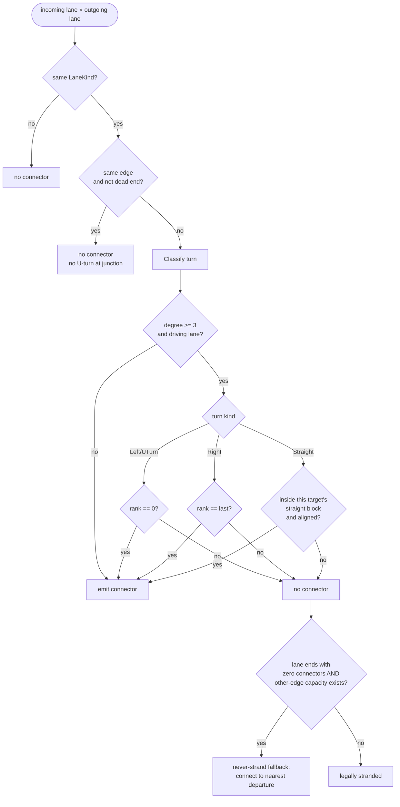

# Lane graph & connectors

Every other network doc in this manual — geometry, junction shape, control — exists
in service of one artifact: the **lane graph**. Edges and nodes are scaffolding;
`Lane`s are the actual vertices vehicles occupy, and `LaneConnector`s are the actual
edges vehicles drive across a node. `ConnectorBuilder` (`src/Domain/Network/ConnectorBuilder.cs`)
decides, for every arriving lane at a node, which departing lanes it may flow into and
what curve it follows there. Get this wrong and the symptom isn't a crash — it's a
driver turning left from the right-hand lane, or (the bug that gave this subsystem its
scars) two lanes' worth of traffic drawn as straight arrows into a road with one lane
to receive them. This is the most careful chapter in the manual on purpose: the file
has been rewritten under bug pressure repeatedly since M5
(`git log --oneline -- src/Domain/Network/ConnectorBuilder.cs` shows six commits, four
`fix:`), and the fixes accreted into subtle rules that are easy to half-remember and
regress against.

## At a glance

- **Source:** `src/Domain/Network/ConnectorBuilder.cs` (301 lines); consumed via
  `RoadNode.Connectors` / `RoadNode.ConnectorConflicts` (`src/Domain/Network/Entities.cs:15-20`);
  lane reachability queries in `src/Domain/Network/LaneGraph.cs`.
- **Entry points:** `ConnectorBuilder.Build(RoadNode, edges)` →
  `IReadOnlyList<LaneConnector>`; `ConnectorBuilder.BuildConflicts(connectors)` →
  `IReadOnlyList<ConflictPoint[]>`.
- **Called by:** `RoadNetwork`'s node-rebuild path, whenever a node's topology or
  geometry changes (`docs/architecture.md`'s network section) — not Godot-visible
  itself, but every debug arrow overlay and every driving vehicle reads its output.
- **Depends on:** `JunctionGeometry.CutT` (endpoints sit at the junction cut, built
  by `JunctionBuilder` — [ch. 03](03-junctions-control.md)), `JunctionControl.Resolve` (right-of-way tags),
  `Bezier3`/`BezierOps`/`ArcLengthTable` ([ch. 01](01-geometry.md)).
- **Used by:** the traffic sim's junction arbiter (`JunctionArbiter.cs`, ch. 05)
  (`JunctionArbiter.cs`, [ch. 05](05-traffic-sim.md)) reads `RightOfWay`/`ConnectorConflicts` to gate node entry; route planning walks
  the lane graph built from `LaneConnector.From`/`To`.
- **Last verified against commit:** `f0542d7` on 2026-07-16.

## Lane ordering

Before any turn logic can run, `ConnectorBuilder` needs each lane's left-to-right rank
within its approach — "leftmost" and "rightmost" are meaningless without a consistent
sort. The naive approach is to sort by `|Offset|` (distance from the centerline), and
it worked for years because every road type had its driving lanes symmetric around
zero. Then M5 added direction-asymmetric types: `OneWay` puts both driving lanes on
the *same* side of the centerline, both `Forward`, at −1.75 m and +1.75 m
(`src/Domain/Catalog/RoadType.cs:113-114`); `Asymmetric` (2+1) puts a `Backward` lane
at −4.25 m and two `Forward` lanes at −0.75 m and +2.75 m (`RoadType.cs:126-129`).
Sorting either set by absolute offset produces nonsense: `OneWay`'s `|{-1.75, +1.75}|`
ties, so the sort is unstable; `Asymmetric`'s `|-0.75| < |+2.75|` puts the −0.75 m lane
"first" even though, relative to the forward travel direction, +2.75 m is the
*right-hand* lane and −0.75 m is the *left-hand* one, closer to oncoming traffic.

The fix, and the rule to never regress, is **direction-aware signed ordering**:
group incoming driving lanes by edge (all lanes from one edge share a travel direction
by construction), then order `Forward` groups ascending by signed `Offset` and
`Backward` groups descending by signed `Offset` (`ConnectorBuilder.cs:57-67`):

```csharp
var ordered = (group.First().lane.Direction == LaneDirection.Forward
    ? group.OrderBy(x => x.lane.Offset)
    : group.OrderByDescending(x => x.lane.Offset)).ToArray();
```

The same pattern, and the same bug class, exists in `TrafficSim._adjacent`
(`src/Domain/Traffic/TrafficSim.cs:527-538`), which computes each lane's left/right
neighbor for lane-change decisions. The two sites cross-reference each other in
comments (`ConnectorBuilder.cs:56`, `docs/gotchas.md:80-88`) so a future fix to one
doesn't leave the other's copy of the bug in place — touch lane adjacency or ranking
logic, check both files.

`ConnectorBuilder` computes this ranking twice: `laneRank` for **incoming** lanes
(`cs:57-67`, which lane earns which turn) and `outRank` for **outgoing** lanes
(`cs:70-80`, which receiving lane a straight connector lands on — next section). Both
are keyed by `LaneId` and store `(index, count)` within the lane's own edge group, not
the whole node.

## Turn classification

`Classify(inDir, outDir)` (`ConnectorBuilder.cs:289-300`) turns a pair of travel
directions into a `TurnKind` (`Straight | Left | Right | UTurn`, `Entities.cs:107`)
using the signed angle between them: cross product for sign, dot product for
magnitude, `Atan2` for degrees. The bands are `|deg| < 30°` → `Straight`,
`|deg| > 150°` → `UTurn`, else `Left`/`Right` by sign (positive rotation toward +Z,
per the project's right-hand-traffic XZ convention — `docs/conventions.md`). These
thresholds are load-bearing: a legitimate ramp or fork can depart an edge within
`TangentContinuationDeg` (1°) of the parent tangent and must still read as `Straight`,
while a genuinely turning arm at a real cross intersection sits well outside 30°.
`Classify` runs at two granularities in `Build`: once **per approach→arm pair**
(`armTurn`, `cs:88-92`, using one representative direction per edge group since all
lanes on an edge share a travel direction — `repIn`/`repOut`, `cs:84-87`), which is
what the turn-lane rules key off of; and once **per actual connector** (`cs:168`),
writing the final `LaneConnector.Turn` — in practice always the same answer as
`armTurn`, since direction is constant within a group.

## Turn-lane assignment

This is the section that has broken the most times. The full algorithm, as it stands
at `f0542d7`, in the order it runs:

**1. Lefts and U-turns are exclusive to the leftmost incoming lane; rights are
exclusive to the rightmost.** At a real junction (`node.Edges.Count >= 3`, `cs:50`),
for driving lanes only, `rank.index == 0` gates `Left`/`UTurn` and
`rank.index == rank.count - 1` gates `Right` (`cs:176-179`). This is the "mandatory
lane change" contract: a driver in an inner lane physically cannot turn left from a
3-lane approach without a preceding lane change, so the connector graph must not offer
that movement. Degree-2 bends and dead-end U-turns are deliberately exempted
(`junction` gates the whole rule at `cs:173`, `docs/gotchas.md:74-76`) because there
the "turn" is really just continuing along one road, not a decision point.

**2. Straights are capacity-aware: an approach must never claim more receiving
lanes than the target arm has.** This is the fix for the codebase's own "M5 arrow
report"/"arrow bug": before commit `2a0e6c9`, the naive rule "every non-turning lane
gets a Straight connector to every same-direction lane on the opposite arm" drew two
straight arrows from a 2-lane approach into a 1-lane receiving road — geometrically
impossible traffic, and a strong-connectivity landmine once the simulation tried to
route real vehicles through it.

The fix builds a `straightBlock` map, one entry per `(fromEdge, toEdge)` pair
classified `Straight` (`cs:117-141`). For source approach `a` with `n` incoming
driving lanes and straight target `b` with `r` receiving lanes,
`surplus = max(0, n - r)`. Surplus sheds from the **left** first — one lane, only if
`a` has a `Left` arm with nonzero capacity (`hasLeft`/`dropLeft`, `cs:123-133`) —
then from the **right** under the same condition (`dropRight`, `cs:134`). Remaining
lanes `[dropLeft, n - dropRight)` are eligible to go straight into `b`. Left-before-right
is deliberate: inner lanes become dedicated turn lanes on the side with usually-lighter
discretionary turning traffic (left, in right-hand traffic) before the outer/right
lane — exactly what `NeckDownWithoutLeftArmDedicatesOuterLaneToRight` and
`TurnLaneAssignmentOnAsymmetricApproach` pin down for the two cases (with vs. without
a left arm).

**3. Per-target capacity caps for forks (M6, commit `25fea99`).** One approach can
have more than one simultaneous `Straight` target: a genuine fork/wye (two roads
splitting off a shared node, both within ±30° — a driver's real either/or choice), or
a tangent-continuation ramp landing inside the ±30° band alongside the "real"
through-arm (`ConnectorBuilder.cs:100-116`). Sizing every target against the full
incoming lane count (step 2 in isolation) is correct for the fork — each branch's own
capacity already covers the shared lane — but wrong for the ramp: a narrow ramp with
less capacity than the main road would still claim every source lane, double-booking
lanes the "real" arm already covers. So whenever `targets.Length > 1`, each target's
block is additionally clamped to `start + r` (`cs:137-138`) — its own receiving
capacity. A lane can still be eligible for several targets (the fork case), but no
single target is ever handed more lanes than it can receive. With one target, the
clamp is a no-op and the uncapped merge-straight fallback from step 2 stands.

**4. Straight connectors pair off aligned, not fanned, when counts allow it.**
`StraightAllowed` (`cs:147-158`) decides, lane by lane, whether an `(inLane, outLane)`
pair inside an eligible block gets a connector, via
`o.index == min(k, o.count-1) || k == min(o.index, blockCount-1)` (`k` = the source
lane's position within its block). Three regimes fall out of one formula:
- **Equal counts:** reduces to `o.index == k` — inner-to-inner, outer-to-outer, one
  connector per lane, no crossing. A naive full fan between equal-size lane sets draws
  diagonal connectors that cross inside the junction pad and manufacture a spurious
  same-node conflict between lanes that should never interact
  (`EqualCountStraightsAreAlignedNotCrossing`, a FourLane×FourLane cross).
- **Fan-out** (source block smaller, e.g. widening road): `min(k, o.count-1)` clamps
  so the source lane connects to multiple receiving lanes as `k` sits at its ceiling.
- **Merge fallback** (receiving block smaller, the "narrowing road" case):
  `min(o.index, blockCount-1)` symmetrically clamps every remaining source lane in
  the block onto the *last* receiving lane rather than leaving it with none
  (`cs:115-116`).

**5. Never-strand fallback (M6, commit `7e525a7`, spec amendment 2026-07-16).**
Steps 1–4 are turn-lane *heuristics*, not a reachability guarantee — with
direction-asymmetric road types, they can conspire to leave a lane with zero
connectors even though the node has somewhere for it to go (`cs:192-204`): e.g. a
second-from-left lane whose sole classified target is `Left`, which rule 1 reserves
for rank 0. After the main connector loop, `Build` scans for any driving lane with
zero connectors so far (`connectedFrom`, `cs:205`) where the node still has departing
driving lanes on some *other* edge, relaxes every rank rule, and connects it to its
geometrically nearest eligible departure (distance between cut positions, ties broken
by lowest `LaneId.Value`, `cs:210-222`). If no departure exists on another edge, the
lane stays connectorless — the legal stranded case (below), not a bug. Same
philosophy as step 4's merge fallback: "lanes with neither alternative keep a
connector rather than going dead," applied as a safety net across the whole rank-rule
apparatus.

**Stranded-lane legality — the iff-rule.** A driving lane arriving with zero outgoing
connectors is **legal if and only if the node has zero departing driving lanes on any
other edge** (same-edge U-turn departures don't count — not junction movements). This
is a deliberate, user-decided ruling (spec amendment 2026-07-16, CS2-inspired):
direction-asymmetric types create lanes with categorically zero destinations by
construction (a two-way road continuing past where a one-way ends; a bulldozed arm
leaving a dead lane pointed at nothing), and the network should commit anyway —
routing never uses the stranded lane, visual feedback deferred to a later milestone —
rather than block the edit or fabricate a destination. `NetworkInvariants.CheckLaneCoverage`
(`src/Domain/Network/NetworkInvariants.cs:131-158`) encodes exactly this iff-rule;
step 5's fallback ensures the *only* time it tolerates a stranded lane is the
categorical case, not a recoverable heuristic gap.



## Conflict points

Once `Build` has the final connector list, `BuildConflicts` (`cs:238-269`) computes,
for every pair of connectors at the node, *where* their paths interact — not just
whether they do. This is the geometric input the traffic arbiter (ch. 05) uses to tell
"a rival is approaching my crossing point" from "a rival already passed it." Two cases:

- **Same-target merges** (`a.To == b.To`, `cs:255-259`): two connectors feeding the
  same receiving lane always conflict; the conflict point is each curve's own *end*
  (`tables[i].TotalLength` on both sides) — a merge conflict isn't a spatial crossing,
  it's "whoever gets to the shared endpoint first."
- **Curve crossings** (`cs:261-266`): `BezierOps.Intersections(a.Curve, b.Curve)`
  finds parametric crossings; the *first* along each curve's own travel
  (`OrderBy(h => h.t1)`) converts to arc-length via each connector's own
  `ArcLengthTable`, producing an `SMine`/`STheirs` pair. `ConflictPoint` (`cs:9`)
  stores `(Other, SMine, STheirs)`. The set is built symmetrically — `sets[i]` gets
  `(j, i's distance, j's distance)`, `sets[j]` the mirrored tuple — so
  `RoadNode.ConnectorConflicts` is symmetric by construction (`Entities.cs:19`).
- **Shared-source exemption** (`a.From == b.From`, `cs:253-254`): connectors leaving
  the *same* lane never conflict — a lane is occupied in strict queue order, so
  whichever connector a vehicle takes, vehicles behind it are already ordered by the
  lane's own queue discipline, not by junction arbitration.

Downstream, `JunctionArbiter` (`src/Domain/Traffic/JunctionArbiter.cs:17-34`, ch. 05)
is the sole consumer: `MayEnter` walks `node.ConnectorConflicts[ci]` and blocks entry
if a conflicting occupant's arc-position is short of `cp.STheirs + Vehicle.Length +
ClearMargin` — the rival hasn't cleared its rear bumper past the shared point.
`SMine` is read by the same file's priority/yield logic to judge the current
vehicle's own approach.

## Worked example

`TurnLaneAssignmentOnAsymmetricApproach` (`tests/Domain.Tests/Network/LaneConnectorTests.cs:122-136`,
fixture at lines 24-34) is the canonical asymmetric neck-down: a 4-way cross where the
south arm is `RoadCatalog.Asymmetric` (2+1) drawn *toward* the node — its two `Forward`
lanes at −0.75 m and +2.75 m both arrive — while the north continuation and the
east–west road are plain `TwoLane` (one `Forward` lane each, +1.75 m).

Ranking the south approach: both lanes are `Forward`, so ascending signed offset gives
rank 0 = −0.75 m (left, closer to the oncoming −4.25 m lane) and rank 1 = +2.75 m
(rightmost). `armTurn` classifies south→north as `Straight`; south→east/west as
`Right`/`Left` (the test only asserts *kind*, not compass arm). North's receiving
capacity is `r = 1`; with `n = 2`, `surplus = 1`. South has a `Left` arm with nonzero
capacity, so `dropLeft = 1`, `surplus → 0`, `dropRight = 0`. The straight block for
south→north is `(start=1, end=2)`: only rank-1 may go straight.

Resulting connectors from the south approach:
- **−0.75 m lane (rank 0):** unconditionally earns the left/U-turn slot (rule 1), and
  sits outside the straight block (`0 < start=1`), so `StraightAllowed` rejects it for
  north. Its only connector is `TurnKind.Left` — `Assert.All(leftLaneConn, c =>
  Assert.Equal(TurnKind.Left, c.Turn))`.
- **+2.75 m lane (rank 1):** inside the block and aligned (`o.index=0 ==
  min(k=0, o.count-1=0)`) → gets `Straight` to north. Also the rightmost lane, so
  rule 1's `Right` gate fires too → additionally gets `Right`. The test confirms both
  and explicitly excludes `Left` from this lane.

The inner lane — the one that would naively also have gone straight — becomes a
*dedicated left* purely because the receiving road can't take two straight lanes; the
outer lane inherits both the through-movement and the right turn. This is exactly the
scenario `2a0e6c9` fixed: before that commit, both south lanes were drawn `Straight`
into a road with a single receiving lane — the arrow bug.

## Invariants

- **Straight sources never exceed receiving capacity for a target**, except where the
  approach demonstrably had no left/right alternative to shed surplus into (the merge
  fallback). `NetworkInvariants.CheckStraightCapacity` (`NetworkInvariants.cs:170-202`)
  encodes the *exact* allowance formula: `allowed = max(capacity, n - hasLeft - hasRight)`,
  mirroring `ConnectorBuilder`'s own drop logic rather than re-deriving it independently.
- **No crossing connectors when source and receiving lane counts are equal** — aligned
  pairing (`EqualCountStraightsAreAlignedNotCrossing`), because crossing connectors
  both look wrong and manufacture a same-node conflict point between lanes that were
  never supposed to interact.
- **Never-strand when departing capacity exists elsewhere at the node** — any arriving
  driving lane gets ≥1 connector unless the node has categorically nowhere else to send
  it (`CheckLaneCoverage`, `NetworkInvariants.cs:131-158`, the iff-rule above).
- **Conflict symmetry** — if connector `i` conflicts with `j`, `j` conflicts with `i`,
  with `SMine`/`STheirs` swapped consistently (`BuildConflicts` constructs both sides
  in the same loop iteration, `cs:257-266`, so they cannot drift apart by construction).

## Tuning constants

- **Turn-angle bands:** `< 30°` Straight, `> 150°` U-turn, else Left/Right
  (`Classify`, `cs:289-300`). Chosen to comfortably contain the ~1° tangent-continuation
  ramp case inside "Straight" while keeping genuine turning arms (typically ≥60-90°
  apart at real cross/T junctions) unambiguously outside the band.
- **Connector reach:** `MathF.Max(Vector3.Distance(inPos, outPos) / 3f, 0.1f)`
  (`cs:186`, and again at `cs:225`) — the bezier control-point offset along each
  endpoint's tangent, i.e. roughly a third of the straight-line endpoint distance
  (clamped to a 0.1 m floor so degenerate/zero-length cases don't produce a
  malformed curve). A purely empirical shape constant for how "loose" a turning arc
  looks; not derived from any physical curvature limit.
- **`ConflictPoint` margins:** consumed downstream, not defined in this file —
  `ClearMargin = 0.5f` and `Vehicle.Length` in `JunctionArbiter.cs:14,32` set how far
  past a conflict point a rival must be before it's considered clear.

## Known limits

- The never-strand fallback (step 5) picks the *nearest* geometric departure with no
  awareness of turn quality — it can connect a lane via what would otherwise classify
  as a sharp Left/Right/U-turn, because its purpose is reachability, not driving
  quality. It only fires in the narrow cases rules 1–4 fail to cover.
- `NetworkInvariants.CheckStraightCapacity`'s allowance formula
  (`max(capacity, n - hasLeft - hasRight)`) is a deliberate mirror of
  `ConnectorBuilder`'s drop logic, documented as intentionally coupled
  (`NetworkInvariants.cs:160-169`). If the drop policy changes, this formula must
  change with it or the checker silently stops catching regressions in the algorithm
  it exists to guard. The M5 fixture tests (`TurnLaneAssignmentOnAsymmetricApproach`,
  `NeckDownWithoutLeftArmDedicatesOuterLaneToRight`) carry independent, hand-computed
  expectations precisely because they share no logic with the checker — the second,
  independent set of teeth.
- `[UNCERTAIN]` The per-target capacity cap (step 3) is documented as covering "fork"
  and "ramp" cases, but no fixture in `LaneConnectorTests.cs` exercises the
  multi-target (`targets.Length > 1`) branch specifically —
  `StraightCapacityInvariantAcrossMixedTypes` covers many road types pairwise, but each
  pairing has a single straight target per approach. Treat this branch as covered by
  the invariant checker at commit time, not by a dedicated example test; worth adding
  one if this logic is touched again.

## How to verify

- **Unit tests:** `tests/Domain.Tests/Network/LaneConnectorTests.cs` — fixtures named
  for what they pin down: `FourWayTwoLaneHasTwelveConnectors` /
  `FourLaneCrossFourLaneConnectorBudget` (connector counts), `NoUTurnConnectors` /
  `DeadEndNodeAllowsUTurn` (junction-vs-dead-end U-turn rule),
  `ConnectorEndpointsSitOnLaneCutPoints` (alignment with `JunctionGeometry.CutT`),
  `GridNetworkLaneGraphIsStronglyConnected` (`LaneGraph.IsStronglyConnected`, scoped
  to `LaneKind.Driving`), `TurnLaneAssignmentOnAsymmetricApproach` /
  `NeckDownWithoutLeftArmDedicatesOuterLaneToRight` (the worked example and its
  mirror image), `EqualCountStraightsAreAlignedNotCrossing` (rule 4's alignment case),
  and `StraightCapacityInvariantAcrossMixedTypes` (the standing regression guard
  across every `RoadCatalog` type pairwise, via `NetworkInvariants.Check(n)`).
- **Invariant checks:** `NetworkInvariants.CheckStraightCapacity` and
  `CheckLaneCoverage` (`NetworkInvariants.cs:131-202`), run via `NetworkInvariants.Check`
  — call this after any change touching `ConnectorBuilder`, `JunctionBuilder`, or the
  road catalog's lane specs, on a network with more than one road type at a junction.
- **Fuzzer:** `docs/verification.md` documents the network fuzz harness — the arrow-bug
  fixes referenced throughout this chapter (`2a0e6c9`, `25fea99`, `7e525a7`) were found
  this way, not by hand-authored fixtures. Run it before calling a change to this file
  done.
- **Full sequence:** `dotnet test`, then `dotnet build citybuilder.sln`, then, if the
  change is geometry-visible, the screenshot harness — connector curves and turn
  restrictions are visible in the debug lane overlay.
