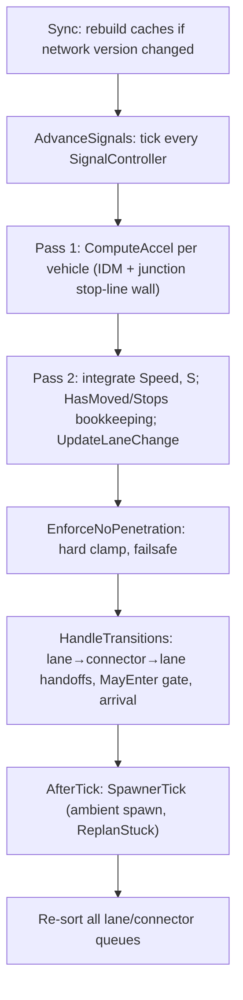

# 05 — Traffic Simulation

`TrafficSim` is the beating heart of the game: a fixed-step, deterministic microsimulation
that drives every car in the city, one lane-follow decision and one junction-entry decision
at a time. Chapters 01–04 (geometry, network validation, junction control, lane
graph/connectors) exist to hand this subsystem a static, pre-solved world — lanes with speed
limits, connectors with right-of-way classes and conflict points already computed.
`TrafficSim` never touches geometry construction; it only reads the derived network and
decides, every tick, how fast each vehicle goes and whether it may cross into the next
segment. The result has to satisfy two competing demands at once: **never let a car
penetrate another or collide at a conflict point** (safety), and **still get minor-road
traffic through a busy junction** (throughput) — M5's defining complaint was an arbitration
scheme so conservative that minor-road cars queued forever behind a "wait for zero oncoming
traffic" rule. `## Junction arbitration` below is the fix, without compromising safety.

## At a glance

- **Source:** `src/Domain/Traffic/{TrafficSim,Vehicle,Idm,JunctionArbiter,TrafficSpawner,RoutePlanner,Route,LaneChange,SignalController}.cs`, `SimInvariants.cs`
- **Entry points:** `TrafficSim.Tick(dt)` (the whole pipeline), `TrafficSim.Spawn(fromEdge, forward, toEdge)`, `RoutePlanner.Plan(...)`
- **Used by:** `src/Game` render/view layer (poses via `TrafficSim.Pose(Vehicle)`, phases via `PhaseFor`), KPI/fuzz harnesses (`SimInvariants.CheckBurst`), test fixtures across `tests/Domain.Tests/Traffic/`
- **Depends on:** `src/Domain/Network` (edges, lanes, `RoadNode.Connectors`/`ConnectorConflicts`, `JunctionControl.Resolve`), `src/Domain/Geometry` (`Bezier3`, `ArcLengthTable`)
- **Last verified against commit:** `a31ebfb` on 2026-07-17 (M6.5 traffic-feel pass)

`TrafficSim` is a `partial class` split across four files by concern: `TrafficSim.cs` owns
spawn/tick/transitions/pose, `JunctionArbiter.cs` owns `MayEnter` and its supporting
right-of-way logic, `LaneChange.cs` owns MOBIL-lite lane changing, `TrafficSpawner.cs` owns
ambient population and stuck-vehicle replanning. This chapter treats them as one module,
which is how the code itself treats them — they share all private state (the `_lanes`,
`_runs`, `_laneVehicles` etc. caches declared in `TrafficSim.cs`).

## The tick

`TrafficSim.Tick(dt)` (`TrafficSim.cs:163-201`) runs the same fixed sequence every step,
called once per physics frame from the game layer (typically 60 Hz, but the model makes
no assumption about `dt` beyond what IDM's math tolerates):



The order matters in specific ways:

1. **`Sync()` first.** If the network changed since the last tick (edit tool moved a road,
   undo/redo, a proposal committed), every cache — lane runs, connector arc-length tables,
   adjacency, per-node `EffectiveControl`, `_incomingLanes` — is rebuilt from scratch before
   anything else touches them (`TrafficSim.cs:465-557`). Vehicles stranded on lanes/connectors
   that no longer exist are dropped here (`RevalidateAfterNetworkChange`, called via
   `OnNetworkChanged`). This has to run before acceleration or transition logic, or those
   would index into now-stale dictionaries.
2. **Signals advance before `MayEnter` is evaluated anywhere downstream** — a green/red
   decision this tick has to reflect this tick's phase, not last tick's.
3. **Acceleration is computed for *every* vehicle before *any* vehicle's `Speed`/`S` is
   updated** (`TrafficSim.cs:169-173` is a separate loop from `175-191`) — the standard
   simultaneous-update discipline for a car-following model. If B's accel depended on A's
   already-updated position this tick, the result would depend on iteration order over
   `_vehicles`, breaking determinism.
4. **`EnforceNoPenetration` runs after integration, before transitions.** IDM keeps the
   *desired* gap comfortable, but two vehicles' accelerations are computed off the same
   pre-tick state, so a tight corner case (slow leader, fast follower solved independently)
   can still integrate into an overlap within one `dt`. `EnforceNoPenetration`
   (`TrafficSim.cs:323-342`) is the hard backstop: one front-to-back pass per queue clamps
   `S` to `leader.S - Vehicle.Length - 0.1f` and caps `Speed` at the leader's — one pass
   suffices because queues are still in last tick's sorted order (no in-lane overtaking).
5. **`HandleTransitions` runs after the failsafe**, so a vehicle's decision to cross into a
   connector or complete a lane is judged against post-clamp `S`, not a possibly-penetrating
   pre-clamp value.
6. **Spawner runs last**, after everyone else has moved and transitioned, so a fresh spawn
   sees this tick's true occupancy.
7. **Re-sorting all queues is the final step** — `SortQueue` orders each lane/connector queue
   descending by `S` (`TrafficSim.cs:583-584`), which is the invariant `LeaderGap`,
   `EnforceNoPenetration`, and `MayEnter`'s conflict scan all lean on (`queue[^1]` = vehicle
   closest to the exit, `queue[0]` = vehicle closest to the entry).

## Car following (IDM)

`Idm.Accel` (`Idm.cs`) is the *only* place acceleration is computed — a single static
function, no per-vehicle state beyond what's passed in. Since M6.5 it implements the
**IDM+ min form** (Schakel et al.) rather than textbook IDM, plus a speed-dependent
**launch boost** (VISSIM CC8/CC9 pattern):

```
free    = 1 − (v / v0)^4
sStar   = s0 + max(0, v·T + v·dv / (2·√(a·b)))
m       = min(free, 1 − (sStar / gap)²)        [if gap is finite]
accel   = aEff(v) · m   if m ≥ 0  (accelerating)
accel   = a · m         if m < 0  (braking — base gain, never boosted)
accel   = aEff(v)·free  [no leader, free ≥ 0]   /   a·free  [no leader, free < 0]

aEff(v) = LaunchA + (A − LaunchA) · v / LaunchFadeSpeed   for v < LaunchFadeSpeed, else A
```

The min form decouples the free-road and interaction terms: at equilibrium the plain
IDM sum under-delivers acceleration (both terms fight), whereas IDM+ takes whichever
constraint binds — measurably tighter queue discharge. The launch boost models a
standing-start (`LaunchA = 3.5 m/s²` at v = 0, fading linearly to `A = 2.6` by
`LaunchFadeSpeed = 5 m/s`); two **sign guards** ensure it only ever amplifies
acceleration, never braking — a negative model output (or `free < 0`, i.e. v above a
turn-capped `v0`) always uses the base `A` gain, otherwise crawling vehicles would
brake up to 35% harder near obstacles. The interaction term (`sStar` via `√(a·b)`)
intentionally keeps base `A` — only the leading multiplier is boosted.

Every constant is tuned, not textbook-default, and each has a specific rationale
(`Idm.cs:8-12`, cross-checked against `docs/conventions.md`):

| Constant | Value | Rationale |
|---|---|---|
| `T` (desired time headway) | **0.95 s** | M5's assertiveness tuning — was 1.1 s before. Directly controls how tight a gap a driver is comfortable following at; the lower value is *the* single biggest lever behind the M5 throughput fix (see `## Junction arbitration`), because a tighter desired headway means less following distance queues up at a stop line, which means more cars physically fit in the window a gap-acceptance check opens up. |
| `S0` (standstill gap) | 2 m | Minimum bumper-to-bumper gap at a dead stop — used elsewhere too, e.g. `SpawnClearance = Vehicle.Length + Idm.S0` (`TrafficSim.cs:17`). |
| `A` (max acceleration) | 2.6 m/s² | Chosen for "snappy, game feel" per the doc comment (`Idm.cs:10`) rather than a literal physical car — this is a simulation-game tuning knob, not a physics constant. |
| `B` (comfortable braking) | 2.8 m/s² | Used both inside IDM's `sStar` term and independently wherever the codebase needs a "how fast can this thing plausibly stop" estimate (spawn safety speed, approach envelopes, `AcceptedGap`'s decel assumption implicitly). |
| `FreeGap` | 1e9 | Sentinel for "no leader within horizon" — `Idm.Accel` special-cases `gap >= FreeGap/2` to skip the interaction term entirely rather than computing a division by a near-infinite number (defensive against float overflow in `sStar/gap`, and cheaper). |
| `LaunchA` (standstill launch) | 3.5 m/s² | M6.5: VISSIM CC8-style standing-start acceleration — the biggest single lever behind the queue-discharge fix, applied only while genuinely accelerating (sign guards above). |
| `LaunchFadeSpeed` | 5 m/s | Speed at which the launch boost has fully faded back to `A` (linear fade). |

Two disciplines matter beyond the formula. First, **all acceleration flows through one
function** — turning, stopping at a wall, lane-change safety checks, and the failsafe never
invent their own kinematics; they all call `Idm.Accel` with a synthesized `(gap, dv)` pair.
`ComputeAccel` (`TrafficSim.cs:207-244`) is the main caller, but when a vehicle is
approaching a junction it can't yet enter, it overwrites `(gap, dv)` with a *virtual
stop-line wall* — the remaining distance to the cut, treated as if a stationary leader
occupied that spot (`TrafficSim.cs:225-229`, `236-240`). That's why a car smoothly
decelerates toward a red light or a blocked yield instead of sailing up at full speed and
stopping instantaneously: IDM's braking profile does the deceleration curve for free once
the "leader" is synthesized correctly.

Second, **desired speed itself bends around upcoming turns** (`DesiredSpeed`,
`TrafficSim.cs`): within 40 m of a connector, `v0` is clamped to a comfortable
braking envelope `√(turnV² + 2·B·dist)` toward the connector's `ConnectorSpeed`. Since
M6.5 turn speeds are **curvature-based** rather than a fixed per-kind table
(`ConnectorSpeed`, `TrafficSim.cs`): Straight = min of the two edges' limits (priority
traffic doesn't brake for junctions at all); turns and U-turns get
`v = √(LateralComfort · Rmin)` with `LateralComfort = 2.2 m/s²` and `Rmin` the
connector curve's minimum radius of curvature (`BezierOps.MinRadius`), floored at 4 m/s
then capped at `straightSpeed` (floor-then-cap, so a road slower than the floor yields
`straightSpeed` instead of an inverted clamp); U-turns get a further 6 m/s cap. `Rmin`
sampling isn't per-tick cheap, so results are cached per `(node, connector index)` and
cleared in `Sync()` with the other network-version-gated caches. This produces the
visible "cars slow down before turning" behavior — a tight Street corner reads ~4-6 m/s,
a sweeping Y-junction noticeably faster — without any separate turn-specific state
machine; it's the same IDM `v0` parameter, just computed contextually.

Third, **per-driver personality** (M6.5): every vehicle carries a seeded, deterministic
`Vehicle.Profile ∈ [0, 1]` (default 0.5 = neutral; ambient spawns draw from the sim's
seeded RNG). On lanes the desired speed scales the limit by `0.85 + 0.35 · Profile` —
0.85× timid, 1.0× neutral, 1.2× assertive — but the turn-approach envelope above is a
physical comfort cap that personality never lifts, and connector speeds themselves are
deliberately unscaled (geometry-bound, not a preference). Profile also shifts junction
gap acceptance (see `## Junction arbitration`).

## Routing

`RoutePlanner.Plan` (`RoutePlanner.cs:20-66`) is a straightforward A* over a state space of
`RouteStep(EdgeId, bool Forward)` — not lanes. This is deliberate: lanes within an edge are a
*tactical* concern (which lane serves my next turn, handled by `LaneChange`/`PickConnector`),
while the strategic route only needs to know which edge-direction to be on next. The
heuristic is straight-line distance from the exit node of a state to the goal edge's
midpoint, divided by `MaxSpeed = 27.8` m/s (the fastest road type) — admissible as long as no
road is faster than that, which the catalog currently guarantees.

The cost model (`Movements`, `RoutePlanner.cs:82-105`, `TurnCost`/`RowCost`,
`RoutePlanner.cs:107-121`) is the reason routed traffic actually prefers priority roads over
stop-controlled shortcuts, not just the fastest edges by travel time:

- **Turn cost**: Straight 0, Right 1.5 s, Left 4 s, U-turn 8 s — a left is penalized nearly
  3× a right because it's slower and riskier to execute in the sim; `ConnectorSpeed`'s
  curvature-based values (M6.5: `√(2.2·Rmin)`, so a given junction's left is usually only
  marginally faster than its right) don't capture that risk at all, so the *routing* layer
  separately bakes in "avoid unnecessary lefts."
- **Control delay cost**: Yield 2 s, Stop 4 s, Signal 5 s, Free 0 s — a proxy for expected
  wait, added atop the geometric edge-time term so the planner detours around a stop sign
  onto a slightly longer Free-flowing road if the total is cheaper. `docs/conventions.md`
  flags this as a coupling to watch: *"if you change a delay constant in the arbiter, check
  RoutePlanner's matching cost"* — the two files encode the same real-world assumption
  independently, and if they drift, routes stop matching what the arbiter actually costs.

At each node, `Movements` collapses every connector into the *cheapest* `(edge, direction)`
target reachable from the arriving lane — if a fork has multiple lanes feeding the same
destination edge with different turn costs, only the minimum is kept
(`best.TryGetValue`/`cost < known`, `RoutePlanner.cs:100-101`), so A* never explores
duplicate, dominated states.

**Replanning** is simply calling `Plan()` again from the vehicle's current edge/direction
toward its original final goal (`Replan`, `TrafficSpawner.cs:61-76`) — there is no persistent
route-diffing or partial-plan patching. This is cheap because A* over a city-sized edge
graph is fast, and it means replanning is *safe to call liberally*: `RevalidateAfterNetworkChange`
calls it for every vehicle whose route references a deleted edge after any network edit
(`TrafficSpawner.cs:106-114`), and `ReplanStuck` calls it for any front-of-queue vehicle
stalled `StuckReplanSec = 20s` (`TrafficSpawner.cs:43-59`) — if no route exists any more
(e.g. its destination edge was deleted), the vehicle gives up and despawns rather than
looping forever.

**Structurally unreachable stranded lanes.** [Chapter 04](04-lane-graph-connectors.md) establishes that `ConnectorBuilder`
guarantees every arriving lane gets at least one connector *when the node has departing
capacity elsewhere* — the exception is a lane that is *legally* stranded (its node offers no
departing driving lane on any edge at all). Because `RoutePlanner`'s A* only ever transitions
along `node.Connectors` (`Movements` filters to `c.From == fromLane`,
`RoutePlanner.cs:88-96`), a legally-stranded lane simply never appears as a reachable
successor state in any plan — there is no special-case "avoid stranded lanes" logic anywhere
in the router; it falls out for free from the fact that the connector graph itself has no
edge leaving that state.

## Junction arbitration

This is M5's crown jewel: `MayEnter` (`JunctionArbiter.cs:17-56`) is the single gate a
vehicle must pass to leave its current lane run and start a connector — every cross-vehicle
interaction at a junction (right-of-way, gap acceptance, deadlock recovery, signals,
stop-sign FIFO) funnels through this one function, called from both `ComputeAccel` (to
decide whether to synthesize a stop-line wall, `TrafficSim.cs:213-231`) and
`HandleTransitions` (to decide whether the crossing actually happens this tick,
`TrafficSim.cs:374`). Both call sites must agree, or a vehicle could brake for a wall it's
actually allowed to drive through — there is exactly one implementation, which keeps them
synchronized structurally rather than by convention.

`MayEnter` runs three checks in order, and any one failing is a hard `false`:

1. **Spillback, with anticipation (M6.5).** If the target lane's tail vehicle — *projected
   `SpillbackAnticipationSec = 0.7 s` ahead at its current speed* — is closer than
   `SpawnClearance` to the entry, refuse. The projection is the M6.5 queue-discharge fix:
   the unprojected check treated a fast-departing leader still inside the clearance window
   as a static obstruction, forcing every follower to a dead stop at the line (~3.4 s
   headways); projecting the occupant forward waves through vehicles whose blocker is
   genuinely moving out of the window. A stopped occupant projects to itself
   (`S + 0·τ = S`), so standstill gridlock-prevention ("don't block the box") is
   bit-identical to the old check (`JunctionArbiter.cs`, guarded by
   `QueueDischargeTests`).
2. **Conflict-point passed-point rule.** For every `ConflictPoint` on this connector (computed
   once in `ConnectorBuilder`, see ch. 04), scan every vehicle currently on the *other*
   connector in that conflict pair; block if any occupant's `S < STheirs + Vehicle.Length +
   ClearMargin` (`JunctionArbiter.cs:28-34`, `ClearMargin = 0.5`). This is not "block while
   anyone is on the conflicting connector" — it's "block until the conflicting occupant's
   *rear bumper* has passed *its own* arc-position of the conflict point by half a metre."
   That distinction is the whole trick: two connectors that cross can be occupied
   simultaneously as long as neither vehicle is near the actual crossing point yet, which is
   physically correct (a car turning left across your straight path doesn't block you while
   it's still 30 m from the intersection) and lets far more traffic flow than a naive
   "connector busy = blocked" rule.
3. **Right-of-way class** (`switch (conn.Row)`, `JunctionArbiter.cs:36-56`):
   - `Free` — clear only needs `ConflictApproachClear`.
   - `Signal` — needs the leg's light green (`IsGreen`) *and* `ConflictApproachClear` (a
     green light doesn't override a still-clearing conflicting occupant).
   - `Yield` — same as Free; the priority difference lives entirely inside
     `ConflictApproachClear`'s rank comparison, not a separate code path.
   - `Stop` — must first be `AtLineStopped` (a genuine `< 0.1 m/s` compliance latch within
     the stop-line zone, `JunctionArbiter.cs:62-74`), then either strict FIFO
     (`AllWayStop`) or the same `ConflictApproachClear` check (a signed stop role at a
     priority junction).

**Movement ranks** (`MovementRank`, `JunctionArbiter.cs:83-96`) turn the qualitative
right-of-way hierarchy into a lexicographic `(Row, Turn)` tuple compared with plain
`CompareTo`: Row axis Free/Signal(green)=3 > Yield=2 > Stop=1; Turn axis Straight=3 >
Right=2 > Left=1 > U-turn=0. Row dominates Turn — a Yield-controlled straight (2,3) still
loses to a Free left (3,1) — which matches the real-world rule that the *leg's* control
status is the primary constraint, turn kind only discriminates *within* the same leg
priority (two Free movements at the same leg: straight beats a turn across the same gap).

**Right-hand-rule window** (`ApproachesFromMyRight`, `JunctionArbiter.cs:100-108`) breaks
equal-rank ties: the signed angle between my connector's entry tangent and theirs, via
`atan2(cross, dot)`, must fall in the open interval `(−150°, −30°)` for "they approach from
my right, so I yield." This window is deliberately not `(−180°, 0°)` — it excludes head-on
opposite approaches (near `−180°`/`+180°`, which is oncoming traffic, not a right-hand-rule
situation — those already differ in Turn rank if either is turning, or are simply not in
actual conflict if both are straight on a divided path) and excludes near-parallel merges
(near `0°`), leaving only genuine "coming from my right" geometry.

**Gap acceptance and impatience** (`AcceptedGap`, `JunctionArbiter.cs`):
`max(2.2 + offset, 2.8 − 0.03·JunctionWait + offset)` seconds, where
`offset = 0.4 − 0.8·Profile` is the M6.5 personality shift (+0.4 s timid, 0 neutral,
−0.4 s aggressive) applied to the whole curve — fresh value and floor alike, so profiles
never converge with enough waiting: a timid driver floors at 2.6 s, the neutral driver
(Profile 0.5) keeps the pre-personality 2.2 s floor bit-for-bit, and only a fully
aggressive driver reaches the 1.8 s hard minimum. A fresh neutral arrival needs a
comfortable 2.8 s gap in oncoming/crossing traffic before committing; every second spent
waiting at the line shaves 0.03 s off that requirement. This is the second lever (after
`Idm.T`) that fixes the M5 "passive cars clog junctions forever" complaint — without
impatience, a minor-road car facing a dense-but-never-quite-zero priority stream would
literally never find a gap it considers safe and would wait indefinitely, and — worse — so
would everyone queued behind it. `ConflictApproachClear` (`JunctionArbiter.cs:114-149`) is
where this is actually applied: for each conflicting connector that outranks (or ties-and-
approaches-from-the-right) mine, walk vehicles feeding that connector within
`ApproachHorizon = 60m`, compute each one's time-to-arrival at the conflict (`dist /
max(speed, 0.5)`), and block if any rival's `tta` is under my `accepted` gap.

**Deadlock breaker** (`DeadlockBreak`, `JunctionArbiter.cs:151-156`; `DeadlockBreakSec = 6`):
if I've waited past 6 s *and* the rival blocking me is itself stationary near its own line
*and* I hold an earlier (or the rival holds no) arrival ticket, I ignore it. This only fires
for `cmp == 0` (equal-rank) standoffs — it exists to break a symmetric four-way-uncontrolled
deadlock where every car is mutually "waiting for the other guy who's waiting for me," which
accepted-gap logic alone can't resolve: `tta`'s `speed` floors at 0.5, so a truly stopped
rival still produces a finite, possibly-small `tta` rather than signalling "not coming
soon." Arrival tickets (`WaitArrivalOrder = Time + v.Id * 1e-6f`, unique per vehicle) are
stamped once, at the stop-line wall in `ComputeAccel` (`TrafficSim.cs:222-223`) or inside
`AtLineStopped` (`JunctionArbiter.cs:71-72`) — the same ticket powers all-way-stop's strict
`FifoTurn` (`JunctionArbiter.cs:160-176`).

**Connector speeds** (already an IDM input above) double as the routing-cost justification
for why lefts are expensive: since M6.5 a turn's speed is its genuine geometric arc speed
(`√(LateralComfort·Rmin)`, clamped [4, straight], U-turn ≤ 6 m/s — see the constants
table), not a penalty — the penalty lives in `RoutePlanner.LeftPenalty` instead; the two
mechanisms are independent but push the same direction.

## Lane changes

`LaneChange.cs` implements MOBIL-lite: **discretionary** changes (chase a small
acceleration gain) and **mandatory** changes (must reach a lane whose connectors serve the
route's next movement before the junction). Both share one mechanism, `TryChange`
(`LaneChange.cs:92-143`): find the would-be leader/follower in the target lane, refuse if
either gap is unsafe (`gapLead < 1f || gapFoll < 0.5f`), compute the new-lane IDM
acceleration, and — for discretionary changes only — require the gain over the current lane
to exceed `DiscretionaryGain = 0.3` m/s² before committing. Once committed, a change takes
`ChangeDuration = 2s` during which the vehicle occupies *both* lanes simultaneously (added
to the target queue immediately, removed from the source queue only on completion,
`LaneChange.cs:23-36`) — this is what lets `EnforceNoPenetration` and `LeaderGap` reason
about a mid-change vehicle correctly from either lane's perspective without special-casing
the transition.

The **adjacency model** (`TrafficSim.cs:523-541`) is direction-aware and this is the one
subtlety worth internalizing before touching it: adjacency is computed *per direction group*
of an edge's driving lanes, ordered by *signed* offset — but which sign means "left" flips
with travel direction. For forward travel, left = smaller (more negative) offset; for
backward travel, left = larger (more positive) offset. The comment at `TrafficSim.cs:523-526`
spells out why: ordering by `|offset|` breaks the moment lanes span zero (an Asymmetric 2+1
road's backward lane at `−4.25` and forward lanes at `−0.75`/`+2.75`, per
`docs/conventions.md`, would sort nonsensically by absolute value). Getting this backwards
is exactly the kind of direction-asymmetric-road bug flagged repeatedly across chapters 03/04
(`gotchas.md:80-88`) as this codebase's single most recurring edge-case source.

**Pre-sorting for turns** happens via the mandatory branch (`MaybeChangeLane`,
`LaneChange.cs:46-90`): once within `MandatoryWindow = 80m` of the junction and the current
lane doesn't serve the next movement, urgency ramps from `SafeFollowerDecel = 2.5` to
`UrgentFollowerDecel = 4.0` m/s² as the cut approaches (linear in `1 − distToCut/80`), relaxing
the safety bar on the *follower's* deceleration the closer the wall gets — a vehicle that
still hasn't merged at the last possible moment will force a tighter gap than one with
plenty of room. Inside `LockInZone = 25m` of the cut, discretionary changes are refused
outright (`distToCut < LockInZone` early return, `LaneChange.cs:77-78`) — a vehicle is
considered committed to its current lane's junction approach and won't second-guess it.

## Trip stats

M6 instrumentation lives mostly on `Vehicle` (`SpawnTime`, `FreeFlowTime`, `Stops`,
`HasMoved`) and is drained into `TrafficSim.TripLog` (a `List<TripRecord>?`, opt-in — null
by default so ordinary simulation runs pay no per-tick allocation, `TrafficSim.cs:51-53`).

**`FreeFlowTime` accumulates incrementally at transitions, not at spawn.** The comment at
spawn time is explicit about why (`TrafficSim.cs:77-80`): computing an estimate from the
*planned* route length up front and then trying to correct it after a replan is exactly the
kind of double-count bug this design avoids. Instead, `FreeFlowTime` starts at 0 and gains
`len / speedLimit` for a lane run, or a fixed `8m / ConnectorSpeed` estimate for a connector
crossing (`TrafficSim.cs:406`, an approximated "typical corner-to-corner arc" rather than a
measured curve length — a KPI estimate, not exact), each time `HandleTransitions` completes
that segment (`TrafficSim.cs:361,378,406`). Because this only ever adds for distance
*actually driven*, a replan mid-route can't retroactively double-book distance the vehicle
already covered under a since-abandoned route — `Replan` (`TrafficSpawner.cs:73-75`)
explicitly needs no `FreeFlowTime` adjustment at all, which is the whole point of the design.

**`Stops` semantics**: a downward crossing of `0.5 m/s`, counted only after `HasMoved`
becomes true (`Speed > 2f` at some point, `TrafficSim.cs:182-185`). The `HasMoved` gate
exists so a vehicle that spawns already stationary (or barely above 0) behind a queue
doesn't get charged a phantom "stop" for never having moved in the first place — only a
genuine decelerate-from-motion event counts. `TripStatsTests.StopControlledApproachRecordsAtLeastOneStop`
(`TripStatsTests.cs:30-59`) is the intent-carrying test: a forced Stop role guarantees the
vehicle must brake below `0.1 m/s` (via `AtLineStopped`) after first exceeding 2 m/s, which
is guaranteed to cross the 0.5 m/s threshold the counter watches.

**Failsafe-under-count caveat** (flagged directly in the tick-order comment,
`TrafficSim.cs:176-179`): `prevSpeed`/`Speed` for the stop-counting comparison are captured
*before* `EnforceNoPenetration` runs later in the same tick. If a stop is induced purely by
the penetration failsafe rewriting `Speed` downward after this comparison already happened,
that stop goes uncounted this tick. In practice this under-counts only genuine near-collision
corrections, not ordinary braking (which IDM already handles via the synthesized gap before
this point) — see `## Known limits` for the same caveat restated as a limitation.

## Worked example

Consider a left-turning vehicle at a busy 4-way `PrioritySigns` cross: it approaches on a
`Yield`-marked minor leg and wants to turn left onto the priority road, crossing the
oncoming priority-road straight movement (rank `(3,3)`) — its own connector is a Yield-left,
rank `(2,1)`. (This mirrors `ArbitrationTests.LeftTurnerOnPriorityRoadYieldsToOncomingStraight`,
`ArbitrationTests.cs:374-385`, though that fixture actually uses two Free legs to isolate the
turn-vs-straight rank gap rather than Yield-vs-Free — the arbitration logic is identical
either way since `ConflictApproachClear` doesn't care *which* Row got it to the comparison.)

1. **Approach** (`DesiredSpeed`, `remaining > 40m`): cruising at the leg's speed limit, no
   constraint yet.
2. **Inside 40 m of the cut**: `DesiredSpeed` starts bending `v0` down toward the Left
   connector's comfortable-braking envelope (`ConnectorSpeed` from the connector's actual
   curvature — for a typical cross-junction left, roughly 5–7 m/s since M6.5), so the car
   is already decelerating smoothly before it reaches the line — no separate "turn signal"
   state, just the IDM `v0` term shifting.
3. **Inside the stop-line zone / at the line**: every tick, `ComputeAccel` calls `MayEnter`.
   The spillback check passes (target lane clear) and the conflict-point rule finds no
   occupant near this connector's own conflict points *yet*. It falls to
   `ConflictApproachClear`: the oncoming straight's rank `(3,3)` beats mine `(2,1)`
   (`cmp > 0`), so I must find it clear. If an oncoming car is inbound with
   `tta < AcceptedGap(me)` (2.8 s, fresh), `MayEnter` returns `false` — `ComputeAccel`
   synthesizes a stop-line wall, and IDM brakes me to a smooth stop at the line rather than
   an abrupt one. `v.BlockedAtLine = true` fires, and if this is the first tick I'm within
   the stop-line zone, `WaitArrivalOrder` is stamped.
4. **Waiting**: each tick blocked adds to `JunctionWait`, which shrinks `AcceptedGap`
   (`2.8 − 0.03·wait + profileOffset`) toward its per-driver floor (2.6 timid / 2.2 mean /
   1.8 aggressive since M6.5; this example's mean driver floors at the classic 2.2 s) —
   the longer I sit, the smaller a gap I'll accept. Note `DeadlockBreak` does *not* apply here: it only fires for `cmp == 0`
   (equal-rank) standoffs, and this movement's `cmp` is `> 0` against the oncoming straight,
   so the only way out of this wait is a genuine gap opening in the oncoming stream — the
   deadlock breaker's domain is a different scenario, e.g. two equal-rank straights at an
   uncontrolled cross (`EqualRankCrossingFollowsRightBeforeLeft`, `ArbitrationTests.cs:417`).
5. **Entry**: once `ConflictApproachClear` returns `true`, `MayEnter` returns `true`;
   `HandleTransitions` fires on the same tick the vehicle's `S` exceeds the lane run's
   length, crediting `FreeFlowTime` for the completed lane run, resetting `HasStopped` /
   `WaitArrivalOrder` / `JunctionWait`, and placing the vehicle onto the connector at its
   overshoot `S`.
6. **On the connector**: now `MayEnter` is never re-checked for this movement — "vehicles
   already inside a junction always finish" (`JunctionArbiter.cs` doc comment). The vehicle
   drives the Left connector's curve at up to `ConnectorSpeed = 10` m/s, watched only by
   `EnforceNoPenetration` and the conflict-point rule from any *other* vehicle's perspective
   (I am now the occupant other connectors' conflict scans watch for — my `S` versus
   `SMine`/`STheirs` at each shared conflict point).
7. **Exit**: `HandleTransitions` hands me onto the destination lane, credits an 8 m/
   `ConnectorSpeed` free-flow estimate for the connector, advances `StepIndex`, and picks a
   new `PlannedConnector` for whatever comes next (or `null` if this was the last step).

## Invariants

- **No penetration, post-failsafe.** Enforced by `EnforceNoPenetration` every tick
  (`TrafficSim.cs:323-342`) and checked externally by `SimInvariants.CheckPenetration`
  (`SimInvariants.cs:48-59`) with a `0.05m` margin — this is checked *after* the tick's
  clamp runs, so a violation here means the failsafe itself has a bug, not that IDM alone
  let something through.
- **No conflict-point co-occupancy.** Two vehicles must never simultaneously sit within
  `Vehicle.Length` of the *same* conflict point on two conflicting connectors
  (`SimInvariants.ConflictPointCoOccupancyViolations`, `SimInvariants.cs:65-84`, margin
  `0.3m`) — this is the safety half of the M5 guarantee, standing-guarded by
  `AssertivenessGuardTests.NoTwoVehiclesEverCoOccupyAConflictPoint`
  (`AssertivenessGuardTests.cs:47-57`) over a 3-minute, 60-vehicle burst.
- **Determinism for a fixed seed.** `TrafficSim`'s only randomness source is the
  constructor-seeded `Random` (`TrafficSim.cs:20,38`), consumed only by the spawner's origin/
  destination/direction picks (`TrafficSpawner.cs:32-36`). Given the same seed and the same
  sequence of `Tick`/`Spawn` calls against the same network, the run is reproducible — the
  simultaneous-update discipline in `## The tick` is what makes this hold despite iteration
  over `_vehicles` (a `List<Vehicle>`, insertion-ordered, not a hash-ordered collection that
  could vary run to run).

## Tuning constants

The full tuning surface, gathered in one place for the post-M6 pass (values already listed
individually above are cross-referenced, not repeated in full):

| Constant | File:line | Value | Rationale |
|---|---|---|---|
| `Idm.T` | `Idm.cs:8` | 0.95 s | M5 assertiveness; was 1.1 s. See `## Car following`. |
| `Idm.S0` | `Idm.cs:9` | 2 m | Standstill gap; reused for `SpawnClearance`. |
| `Idm.A` | `Idm.cs:10` | 2.6 m/s² | Game-feel snappiness, not literal physics. |
| `Idm.B` | `Idm.cs:11` | 2.8 m/s² | Comfortable braking; reused in approach envelopes. |
| `Idm.FreeGap` | `Idm.cs:12` | 1e9 | No-leader sentinel. |
| `Idm.LaunchA` | `Idm.cs` | 3.5 m/s² | M6.5 standing-start launch boost (acceleration only — sign-guarded). |
| `Idm.LaunchFadeSpeed` | `Idm.cs` | 5 m/s | Launch boost fully faded back to `A` at this speed. |
| `Vehicle.Profile` | `Vehicle.cs` | [0, 1], default 0.5 | M6.5 personality: desired speed ×(0.85 + 0.35·Profile), `AcceptedGap` offset 0.4 − 0.8·Profile. Seeded/deterministic for ambient spawns. |
| `TrafficSim.LateralComfort` | `TrafficSim.cs` | 2.2 m/s² | M6.5 curvature turn speeds: `v = √(LateralComfort·Rmin)`, floored 4 m/s, capped at straight speed; U-turn cap 6 m/s. Cached per connector, cleared on `Sync()`. |
| `TrafficSim.LookAheadHorizon` | `TrafficSim.cs:16` | 120 m | Declared but not read within the files in scope — `[UNCERTAIN]` whether it is consumed elsewhere in `src/Game` or is dead/reserved. |
| `TrafficSim.SpawnClearance` | `TrafficSim.cs:17` | `Vehicle.Length + Idm.S0` = 6.5 m | Minimum space a fresh spawn (or an entering junction movement) needs at the entry. |
| `Vehicle.Length` | `Vehicle.cs:10` | 4.5 m | Also the conflict-margin unit throughout the arbiter. |
| `StopLineZone` | `JunctionArbiter.cs:12` | 3 m | "At the line" distance for stop compliance and wait-ticket stamping. |
| `ApproachHorizon` | `JunctionArbiter.cs:13` | 60 m | How far `ConflictApproachClear` scans a conflicting leg's queue for inbound rivals. |
| `ClearMargin` | `JunctionArbiter.cs:14` | 0.5 m | Rear-bumper clearance required past a conflict point. |
| `DeadlockBreakSec` | `JunctionArbiter.cs:15` | 6 s | Wait time before ignoring a stale equal-rank rival. |
| `SpillbackAnticipationSec` | `JunctionArbiter.cs:16` | 0.7 s | M6.5 queue-discharge fix: exit-lane occupant projected this far ahead before the clearance comparison; stopped occupants block identically to the unprojected check. |
| `AcceptedGap` formula | `JunctionArbiter.cs` | `max(2.2, 2.8 − 0.03·wait) + (0.4 − 0.8·Profile)` s | Impatience curve (M5) with M6.5 personality offset; floors 2.6 (timid) / 2.2 (neutral) / 1.8 (aggressive). |
| Movement rank axes | `JunctionArbiter.cs` | Row 3/2/1, Turn 3/2/1/0 | Lexicographic; Row dominates Turn. |
| Right-hand-rule window | `JunctionArbiter.cs` | `(−150°, −30°)` | Excludes head-on and near-parallel angles. |
| `ConnectorSpeed` (turns) | `TrafficSim.cs` | `√(2.2·Rmin)` in [4, straight]; U-turn ≤ 6 m/s | M6.5 curvature-based (was fixed 9/10/5). Straight uses the road's own limits — priority traffic doesn't brake for junctions. |
| `SpawnCooldownSec` | `TrafficSpawner.cs:12` | 0.25 s | Ambient spawn attempt cadence once under target population. |
| `StuckReplanSec` | `TrafficSpawner.cs:13` | 20 s | Stall duration before a front-of-queue vehicle gets a fresh route. |
| `ChangeDuration` | `LaneChange.cs:14` | 2 s | Dual-lane occupancy window during a lane change. |
| `EvalInterval` | `LaneChange.cs:15` | 0.5 s | How often a settled vehicle re-evaluates lane-change opportunities. |
| `PostChangeCooldown` | `LaneChange.cs:16` | 2.5 s | Refractory period after completing a change, preventing thrash. |
| `MandatoryWindow` | `LaneChange.cs:17` | 80 m | Distance from a junction where "must merge for my turn" pressure begins. |
| `LockInZone` | `LaneChange.cs:18` | 25 m | Inside this, discretionary changes are refused — committed to the approach. |
| `DiscretionaryGain` | `LaneChange.cs:19` | 0.3 m/s² | Minimum acceleration improvement required to justify an unforced lane change. |
| `SafeFollowerDecel` / `UrgentFollowerDecel` | `LaneChange.cs:20-21` | 2.5 / 4.0 m/s² | Safety bar on the new follower's forced braking; relaxes as junction urgency ramps. |
| `RoutePlanner` turn costs | `RoutePlanner.cs:16` | Left 4 s, Right 1.5 s, U-turn 8 s | Strategic bias against turns, independent of `ConnectorSpeed`. |
| `RoutePlanner` control-delay costs | `RoutePlanner.cs:17` | Yield 2 s, Stop 4 s, Signal 5 s | Must stay consistent with arbiter delay behavior per `docs/conventions.md`. |
| `RoutePlanner.MaxSpeed` | `RoutePlanner.cs:18` | 27.8 m/s | A* admissible-heuristic speed; must be ≥ every road's actual speed limit. |
| `SignalController.GreenSec/AmberSec/AllRedSec` | `SignalController.cs:13` | 12 / 3 / 1 s | Owned in depth by [ch. 03](03-junctions-control.md); noted here only as an arbiter-facing input via `IsGreen`. |
| `SimInvariants.PenetrationMargin` | `SimInvariants.cs:14` | 0.05 m | Burst-checker tolerance for the no-penetration invariant. |
| `SimInvariants.ConflictMargin` | `SimInvariants.cs:15` | 0.3 m | Mirrors `AssertivenessGuardTests`'s co-occupancy tolerance. |

## Known limits

- **Protected lefts are deferred.** There is no dedicated "left-turn-only green phase"
  concept anywhere in `SignalController` or `MayEnter` — a left at a signal still resolves
  through the same `ConflictApproachClear` rank/gap logic as an unsignalled Yield left. Real
  protected-left phasing (a genuinely conflict-free window) is not modeled.
- **Merge-conflict tail blind spot.** `ConflictApproachClear` only scans vehicles on the
  *feeding lane* of a conflicting connector (`_laneVehicles[other.From]`,
  `JunctionArbiter.cs:131`) within `ApproachHorizon`. A vehicle already committed on the
  conflicting *connector itself* (past the stop line, mid-turn) is caught by the separate
  conflict-point passed-point rule, not by this scan — but a rival that's mid-lane-change
  onto that feeding lane, or otherwise not yet cleanly "on" it, is a gap in coverage the
  passed-point rule and this scan together don't fully close. `[UNCERTAIN]` — I did not find
  a test exercising this specific tail case; flagged as a plausible edge case from reading
  the code, not a confirmed bug.
- **Saturation headway — RESOLVED in M6.5.** `docs/health/M6.md` recorded a measured
  `sat_headway_s ≈ 3.522` baseline; the M6.5 traffic-feel pass diagnosed the true cause as
  the *unprojected spillback check* (every discharging follower braked to a dead stop at
  the stop line behind a leader that was already accelerating away on the exit lane), not
  car-following. The anticipatory spillback projection (`SpillbackAnticipationSec = 0.7`)
  plus IDM+/launch acceleration brought the measured value to **2.04 s** (`docs/health/M6.5.md`),
  inside the 1-3 s HCM saturation-headway plausibility band. The minor-road discharge
  calibration moved with it: `MinorRoadDischargesThroughPriorityStream` now measures 21/40
  in 2 sim-minutes (floor raised to 18 = measured − 3, `AssertivenessGuardTests.cs`).
- **Failsafe-stop under-count.** As detailed in `## Trip stats`, a stop induced purely by
  `EnforceNoPenetration`'s post-integration clamp is invisible to the `Stops` counter for
  that tick, because the counter's before/after `Speed` snapshot happens earlier in the tick
  than the clamp (`TrafficSim.cs:176-191` vs `323-342`). This under-counts near-collision
  corrections specifically, not ordinary braking.

## How to verify

- `dotnet test` — full domain suite; `tests/Domain.Tests/Traffic/*` covers following,
  arbitration, lane changes, spawning, signals, routing, motion continuity, invariants, and
  trip stats (one file each, named accordingly).
- **`AssertivenessGuardTests`** are the standing M5 regression guards: run these first after
  touching `JunctionArbiter.cs` or `Idm.cs` — `NoTwoVehiclesEverCoOccupyAConflictPoint`
  (safety, 3-minute/60-vehicle burst) and `MinorRoadDischargesThroughPriorityStream`
  (throughput floor: the guard requires ≥18/40 minor arrivals in 2 sim-minutes — M6.5
  measures 21/40, vs 18/40 at M5 and the 7/40 pre-M5 baseline).
- **`SimInvariants.CheckBurst(network, seed, ticks, population)`** — the general-purpose
  fuzz/burst harness: spawn an ambient population on any network, tick it, and get back an
  empty violation list or a diagnosed exception/penetration/co-occupancy failure. Use it
  against any newly-generated or fuzzed network topology before trusting it's drivable.
- **KPI suite + `docs/health/M6.md`** — the M6 quality-stack scenarios (`KpiScenarios.cs`)
  give the plausibility-anchored numbers referenced above (`sat_headway_s`, discharge
  rates), with methodology documented as doc comments in the test file itself.
