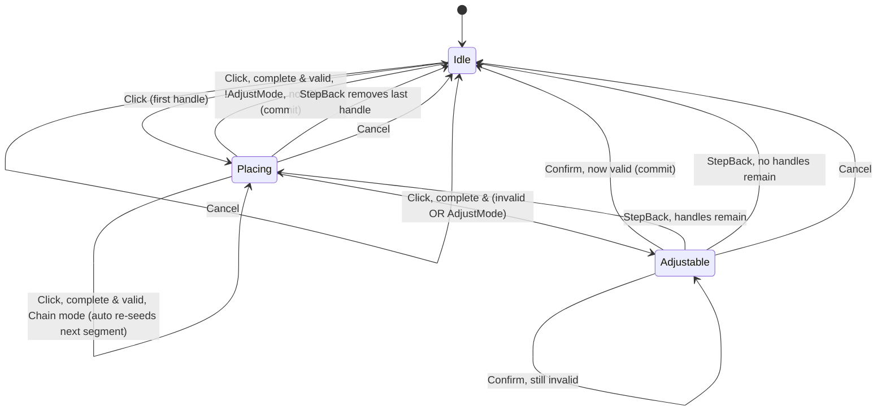

# Chapter 06 — Drafting & Snapping

This is the M4 gesture system: the layer that turns a sequence of mouse clicks into a
validated, committable road. Nothing here draws anything — `DraftSession` is a pure
domain state machine that owns an in-progress `RoadDraft` (an ordered list of draggable
`DraftHandle`s plus a shape strategy), asks `SnapEngine` where each click "really"
landed given the current drawing context, asks `RoadNetwork.Validate` ([chapter 02](02-network-validation.md))
whether the resulting curve(s) are legal, and either commits immediately or drops into
an editable `Adjustable` state so the player can drag handles until it is. The Godot
layer (`ToolController`, out of scope here) only forwards raw world-space clicks and
renders whatever `DraftSession` exposes (`Draft`, `Ghost`, `LastSnap`, `Readout`). Every
concept in this chapter — the session's states, the six draft shapes, the snap
candidate model, the pre-network validation guards — is exactly the surface
`GestureFuzzer` (`tests/Domain.Tests/Fuzzing/GestureFuzzer.cs`) drives when it hammers
the editor headlessly; if this chapter is accurate, the fuzzer's action space is fully
explained.

## At a glance

- **Sources:** `src/Domain/Tools/Draft/DraftSession.cs`, `RoadDraft.cs`, `Shapes.cs`;
  `src/Domain/Tools/Snapping/SnapEngine.cs`, `SnapTypes.cs`;
  `src/Domain/Tools/PlacementProposal.cs`.
- **Key types:** `DraftSession` (the state machine), `RoadDraft` + `IDraftShape`
  (six implementations: `StraightShape`, `QuadCurveShape`, `CubicCurveShape`,
  `ArcShape`, `GridStampShape`, and `DraftMode.Chain` which reuses `QuadCurveShape`),
  `DraftHandle` (position + how it snapped), `SnapEngine` + `SnapCandidate` (scored
  snap resolution), `PlacementProposal`/`ProposedCurve`/`EndpointBinding`
  (`Free`/`AtNode`/`OnEdge`) and `ValidatedPlacement`/`CommitResult` (defined here,
  populated by `RoadNetwork` — ch. 02).
- **Entry points:** `DraftSession.SetMode`, `.Click`, `.PointerMoved`, `.StepBack`,
  `.Cancel`, `.Confirm`, `.TryBeginHandleDrag`/`.EndHandleDrag`,
  `.ReleaseTangentLock`.
- **Used by:** `src/Game`'s `ToolController` (not in this chapter's scope) forwards
  raw pointer input 1:1 to these methods and renders `Draft`/`Ghost`/`LastSnap`/
  `Readout`; `GestureFuzzer` drives the identical surface headlessly for invariant
  fuzzing.
- **Depends on:** `RoadNetwork.Validate`/`.Commit` (ch. 02) for all substantive
  geometry legality; `Bezier3`/`BezierOps` ([ch. 01](01-geometry.md)) for curve construction
  (`Bezier3.FromQuadratic`, `BezierOps.ArcFromTangent`) and `MinRadius` for the live
  readout; `RoadCatalog`/`RoadType` (ch. 02) for per-type floors and `OuterHalf`
  (parallel-guide offset).
- **Last verified against commit:** `f0542d7`, 2026-07-16.

## The session state machine

`DraftSession.State` is one of `Idle`, `Placing`, `Adjustable` (`DraftSession.cs:10`).
There is no "Dragging" state — dragging a handle (`DraggingHandle >= 0`) is orthogonal
to `State` and can happen while `Adjustable` (editing a rejected placement) or, in
principle, while `Placing` (nothing stops `TryBeginHandleDrag` mid-gesture, though the
game layer is expected to only offer it once a shape is complete).

`Click` (`DraftSession.cs:96-127`) is a no-op while `Adjustable` (`:98-99`) — handles
are dragged in that state, and commit only happens through `Confirm`. Otherwise it
resolves the point through `SnapEngine`, lazily creates a `RoadDraft` for the current
`Mode` on the first click (adopting an inherited chain tangent if one is pending),
appends a handle, and calls `CompleteDraft` once `RoadDraft.IsComplete`.
`CompleteDraft` (`:173-188`) builds the proposal, validates it, and — if valid and
`!AdjustMode` — delegates to `TryCommit`; otherwise it fires `Flashed` with a reason
and drops to `Adjustable`. `AdjustMode` (a session-level toggle, not a state) is the
"always let me tweak before committing" preference: even a fully valid shape stops at
`Adjustable` when it's on (`DraftSessionTests.AdjustModeHoldsTheDraftUntilConfirm`).

`StepBack` (`:54-75`) behaves differently by state. From `Adjustable` it first drops
to `Placing` — the comment at `:60-61` explains why: the draft must become genuinely
incomplete again, or the next click would append a handle past the shape's required
count instead of correcting the existing one. From `Placing` it just removes the last
handle; none left cancels the whole draft. `Cancel` (`:44-52`) unconditionally clears
`Draft`/`Ghost`/`Readout`/`DraggingHandle` and any pending `_chainTangent`, returning
to `Idle` — `SetMode` always calls it, so switching tools mid-gesture silently
discards the in-progress draft.

Handles are editable in place: `TryBeginHandleDrag` (`:146-165`) hit-tests the
current draft's handles within `pickRadius`; `PointerMoved` (`:77-94`) while dragging
calls `RoadDraft.MoveHandle` and revalidates on every move (live ghost updates while
`Adjustable`); `EndHandleDrag` clears the index. Dragging handle 0 re-derives
`StartTangent` from whatever it re-binds to (or clears it, unlocking the shape);
dragging handle *i > 0* deliberately keeps the snap anchor pinned to handle 0, not the
dragged handle — `Resolve`'s comment at `:273-276` records this as a real bug fix:
anchoring to the point being dragged made angle-snap noisy and fed the
perpendicular-snap producer a degenerate reference direction.

**What commits and when.** Only two call sites ever call `network.Commit`:
`CompleteDraft` (a fresh gesture completing validly, not in `AdjustMode`) and
`Confirm` (an `Adjustable` draft becoming valid — `Confirm` re-validates first, it
never trusts the stale `Ghost`). Both funnel through `TryCommit` (`:190-231`), which
is also where the M6 **`Flashed` contract** lives: on a hard failure (`validated is
null`, `!validated.IsValid`, or `!result.Success`) it fires one human-readable string
and stays/returns to `Adjustable`; on success with `result.DroppedSegments > 0` it
*also* fires `Flashed` — a singular/plural "degenerated while merging and were
skipped" message — even though the commit succeeded. `DroppedSegments` is a
`RoadNetwork.Commit` concept (ch. 02): node-reuse relocation during a multi-curve
commit can shrink a segment below its type's floor, and rather than fail the whole
gesture the commit-side guard drops just that segment and reports the count.
`Flashed` is therefore not a pure error channel — a non-null string doesn't mean
nothing was built.

## Draft shapes

`IDraftShape` (`RoadDraft.cs:17-23`) is a small, stateless strategy interface:
`RequiredHandles(tangentLocked)`, `RoleOf(index, tangentLocked)` (`Endpoint` /
`Control` / `Direction`, purely for the game layer's rendering), and
`Curves(handles, startTangent)`, which returns the `Bezier3` list for the handles seen
so far (used both for the final proposal and, via `RoadDraft.Preview`, for the
hover ghost).

- **`StraightShape`** (`Shapes.cs:8-21`) — always 2 handles regardless of lock; a
  line has no tangent to depart at an angle from, so the doc comment notes
  `SharpAngle` validation (next section) rejects a non-tangential exit anyway rather
  than the shape enforcing it.
- **`QuadCurveShape`** (`Shapes.cs:48-75`) — 3 handles (start, control, end) unlocked,
  2 (start, end) locked. Locked, the control point is *implied* at 40% of the chord
  along the locked tangent, oriented toward the endpoint via `ShapeUtil.Orient`. Both
  branches finish with `ShapeUtil.ApplyArrival` (`Shapes.cs:32-43`), which re-aims the
  last control point along the end handle's `DirectionConstraint` if the snap
  produced one (e.g. landing perpendicular onto an edge) — this is what makes a curve
  arrive G1-clean at the far end, not just the near end.
- **`CubicCurveShape`** (`Shapes.cs:79-111`) — 4 handles unlocked (start, 2 controls,
  end), 3 locked (first control implied at a third of the chord along the tangent).
  Same `ApplyArrival` treatment at the end.
- **`ArcShape`** (`Shapes.cs:116-145`) — 3 handles unlocked (start, a *direction*
  handle, end), 2 locked (the lock supplies the direction). Delegates to
  `BezierOps.ArcFromTangent`, which fits a constant-radius arc through the tangent
  and endpoint, caps the sweep at 175° (`BezierOps.cs:226`, returning `null` past it
  rather than clamping), and splits sweeps over 90° into two Bezier segments
  (`:259`) since one cubic can't hold a wide arc without visible drift. This is the
  shape the live radius readout (`DraftSession.UpdateReadout`, `:243-265`) is built
  for — `Readout.RadiusM` is `BezierOps.MinRadius` sampled across the ghost proposal.
- **`DraftMode.Chain`** is not its own `IDraftShape` — `ShapeOf` (`DraftSession.cs:307`)
  maps it onto a plain `QuadCurveShape`. The "chain" behavior lives entirely in
  `TryCommit` (`:220-230`): after a successful commit, the session captures the
  curve's end tangent (`lastCurve.Tangent(1)`), builds a new `RoadDraft`, locks its
  start tangent to it, seeds it with one handle at the committed endpoint's
  `SnapResult`, and leaves `State` at `Placing` — the next click only supplies the
  new segment's endpoint (locked `QuadCurveShape` needs 2, one is already there).
  Each click after the first extends the road, always G1-continuous, until `Cancel`
  ends the run (`GestureFuzzer.DrawGesture` does this explicitly, `:206`).
- **`GridStampShape`** (`Shapes.cs:150-194`) — always 3 endpoint handles: origin,
  a point along axis 1, and a point whose perpendicular component (after removing
  its axis-1 projection) defines axis 2's extent. Stamps a rectangular grid of
  straight roads at `CellSize = 48 m` (`:152`) spacing; `n1`/`n2 = floor(axisLength /
  48)`, so only whole cells are kept, and an axis shorter than one cell returns
  `null`. This 48 m stamp spacing is unrelated to the *snap* grid's cell size (next
  section) — same word, two independent concepts.

**Tangent-lock release.** `RoadDraft.TangentLocked` is `StartTangent is not null`
(`RoadDraft.cs:35`). `DraftSession.ReleaseTangentLock` (`:131-137`) is the spec'd
toggle the game layer binds to a key — `DraftSessionTests.cs:147`'s comment names it:
"T (game layer) releases the lock." It calls `RoadDraft.UnlockStartTangent`
(`StartTangent = null`); since `IsComplete` reads `shape.RequiredHandles
(TangentLocked)` live, the shape immediately falls back to its unlocked handle count
— e.g. a `QuadCurveShape` with 1 of 2 locked handles now needs a control point before
an end point. Chain continuation always *re-locks* (`TryCommit`'s chain branch), so
the lock is the default for chain segments and something the player opts out of per
segment, not per gesture.

## Snapping

`SnapEngine.Resolve` (`SnapEngine.cs:39-84`) is a candidate-scored resolver, not a
priority cascade: every enabled snap kind contributes zero or more
`SnapCandidate`s (position + `Kind` + `Weight`, plus kind-specific payload — a
`NodeId`, an `(EdgeId, T)`, a direction, or the guideline(s) involved), and the
lowest-**score** candidate wins, where `score = distance / weight`
(`SnapEngine.cs:64`). Weight therefore isn't a tie-breaker bolted on after distance —
it rescales distance directly, so a *dead-on* weak-kind candidate can still beat a
*barely-in-range* strong-kind one
(`SnapEngineTests.DeadOnWeakSnapBeatsBarelyInRangeStrongSnap`: a guideline hit at
0.01 m beats a node 4.6 m away even though nodes carry more than double the
guideline's weight). If nothing scores within `radius`, `Resolve` falls back to angle
snap (if enabled and an anchor exists) and finally to `SnapResult.Free`.

Weights, verified against `SnapEngine.cs:31-37`:

| Kind | Weight | Producer |
|---|---|---|
| `Node` | 4.0 | `AddNodeCandidates` — any node within `radius` |
| `GuidelineIntersection` | 2.5 | `AddGuidelineCandidates` — pairwise intersections of active guidelines |
| `Perpendicular` | 2.2 | `AddPerpendicularCandidates` — foot of perpendicular from `ctx.Anchor` onto any edge |
| `Edge` | 2.0 | `AddEdgeCandidates` — closest point on the nearest edge centerline |
| `Guideline` | 1.5 | `AddGuidelineCandidates` — projection onto one active guideline |
| `GridPoint` | 1.5 | `AddGridCandidates` — nearest grid intersection |
| `GridLine` | 1.0 | `AddGridCandidates` — nearer of the two axis-aligned grid lines through the cursor |

Node's weight is explicitly *not* the value the original spec sketched — the comment
at `SnapEngine.cs:29-30` records that 3.0 lost to an edge candidate 1.2 m away when
the node was 1.9 m away, breaking the intended "prefer connecting to a node" UX; 4.0
fixes that specific ported test (`NodeBeatsEdgeWhenBothInRange`) rather than being
derived from a formula. `Guideline` and `GridPoint` sharing 1.5 is presumably
deliberate (both are "soft alignment aids," not real network features) but this is
**[UNCERTAIN]** — no comment confirms the equality is intentional, not coincidental.

Guidelines are the dashed "extend this road's tangent past its node" construction
lines (`Guideline` record, `SnapTypes.cs:24-27`); `CollectGuidelines` (`:192-213`)
builds one per edge leaving every node within `GuidelineSearch = 200 m` of the
cursor, reaching `GuidelineReach = 200 m` past its origin. `Perpendicular` snapping
only activates with `ctx.Anchor` set (`:52`) — it needs a "from where," which is the
anchor `DraftSession.Resolve` supplies (the fixed start handle); it's unavailable on
a gesture's first click. `Parallel` guides (`AddParallelGuides`, `:226-252`) are
curb-to-curb offset lines beside existing *straight* edges (curved edges spawn none,
`SnapEngineTests.CurvedEdgeSpawnsNoParallelGuide`), offset by `existingType.OuterHalf
+ newType.OuterHalf`; they only appear when `ctx.DrawingType`, the `Parallel` flag,
*and* the top-level `Guidelines` flag are all set (`Parallel` candidates are added
from inside `CollectGuidelines`, itself gated on `Guidelines`) — `Parallel` alone
does nothing.

**Snap radius contract.** `Resolve` takes `radius` as a caller-supplied parameter;
the domain neither owns nor clamps it. The game layer derives it from camera
distance (`camDist × 0.02`, clamped `[1, 20]`, per `docs/conventions.md`);
`GestureFuzzer` fixes it at 6 (a representative mid-zoom value, `:29-32`) so a
failing seed's snapping behavior stays reproducible from the seed alone.

**Grid.** Two unrelated grids exist: `GridStampShape.CellSize = 48 m` (the fixed
stamp spacing above) and `GridConfig` (`SnapTypes.cs:30-33`, the cursor-snap grid),
whose `Default` cell is 8 m, toolbar-selectable among 4/8/16/32 m, off by default
(`EnabledSnaps` starts as `SnapTypes.All & ~SnapTypes.Grid`, `DraftSession.cs:26`).
`AddGridCandidates` only runs when `ctx.Grid` is non-null, which `Resolve` only
supplies when the `Grid` flag is enabled (`:280-281`) — toggling grid off is a real
no-op for scoring, not just rendering.

## Validation guards

There is a real division of labor here, and it is narrower than it might look.
`RoadDraft`/`Shapes.cs` perform exactly one class of check before a proposal is even
built: degenerate-input guards. `StraightShape.Curves` refuses two coincident points
(`Vector3.Distance(a, b) < GeoConstants.Eps`, `Shapes.cs:19`); `ArcShape` and
`GridStampShape` refuse a zero-length or degenerate axis vector the same way. These
don't produce an *invalid* `ValidatedPlacement` — they return `null` from
`Curves`/`Proposal`, so `BuildProposal`/`Preview` return `null` too, and
`DraftSession.CompleteDraft` reports "shape is not buildable here" without ever
calling `network.Validate`. `PlacementProposal.cs` itself carries **no logic at all**
— it's the data contract (`ProposedCurve`, `EndpointBinding`'s three cases,
`PlacementError` enum, `ValidatedPlacement`/`CommitResult` records) that the draft
layer produces and `RoadNetwork` consumes and populates.

Every substantive numeric guard — the kind a fuzz seed can actually trip — lives in
`RoadNetwork.Validate` (`RoadNetwork.cs:69-173`, ch. 02's chapter, summarized here
because the draft layer's whole job is producing input that survives it):

- **`MinSegmentLength = max(8 m, Width)`** per road type (`RoadType.cs:19`): TwoLane 8,
  Street 12, OneWay 12, Asymmetric 12, FourLane 16, Avenue 21 m. Applies to the
  proposed curve's own length, to slivers a crossing would leave on an *existing*
  edge, and to the spacing between consecutive crossings/ends along one proposed
  curve or across the whole proposal on one existing edge (`RoadNetwork.cs:80,
  112-135, 153-165`).
- **Per-type `MinRadius`**: TwoLane 20, Street 10, OneWay 10, Asymmetric 20, Avenue 25,
  FourLane 35 m (`RoadCatalog.cs`), checked via `BezierOps.MinRadius`
  (`RoadNetwork.cs:83`).
- **25° `MinJunctionAngleDeg`** (`RoadNetwork.cs:23`): the floor for any two legs
  meeting at a node (`SharpAngle`, `Kinked` between curves of the same proposal) *and*
  for proposal-vs-existing crossings (`CrossingTooShallow`) — a crossing is a future
  junction and obeys the same rule.
- **1° `TangentContinuationDeg`** G1 exemption (`RoadNetwork.cs:27`): a departure from
  an `OnEdge` binding within this angle of the edge's own tangent is a legitimate
  ramp exit, not a sharp bump, and is exempted from `SharpAngle`
  (`HasSharpLeg`, `RoadNetwork.cs:229-242`). Critically, this exemption is
  `fromEdge`-only — `AtNode` bindings stay strict at the full 25° floor even at
  near-zero angles (`RoadNetwork.cs:236` checks `fromEdge && deg <= 
  TangentContinuationDeg`); a chain segment landing exactly on an existing *node*
  gets no G1 slack the way one landing mid-edge does.
- **Crossing-spacing floors**: a crossing within `NodeReuseRadius` (0.5 m) of the
  proposal curve's own endpoint is treated as a clean connection, not a crossing, at
  all (`RoadNetwork.cs:99-100`); one landing within `NodeReuseRadius` of an *existing*
  edge's end similarly extends that edge's node rather than counting as a sliver
  (`:108-109`); everything else is measured against the crossed edge's own
  `MinSegmentLength`.

The commit-side floor guard (`RoadNetwork`'s node-reuse relocation possibly shrinking
a segment below its floor, surfaced as `CommitResult.DroppedSegments`) and the
sharp-angle-at-node logic invoked once the real attaching node is known
(`HasSharpLegAtNode`) are commit-time mechanisms, not `Validate`-time ones — full
treatment is ch. 02's, not this chapter's.

## Worked example

A player in `DraftMode.Chain`, `RoadType = TwoLane`, drawing three chained segments —
the last click snapping onto an existing node from an earlier, unrelated road.

1. **Click (0, 0, 0).** `Draft` is null, so `Click` creates a fresh
   `RoadDraft(QuadCurveShape, TwoLane)` (unlocked), adds handle 0.
   `RequiredHandles(false) == 3` → incomplete. **State → `Placing`.**
2. **Click (50, 0, 30).** Handle 1 (control point). Still 2 of 3. **`Placing`.**
3. **Click (100, 0, 30).** Handle 2 completes the shape. `CompleteDraft` builds the
   quadratic through (0,0)→(50,30)→(100,30), validates (long enough, gentle curve,
   nothing to cross) — valid — and `TryCommit` commits it. Since `Mode == Chain`, the
   session captures the curve's end tangent (~+X), builds a new locked `RoadDraft`,
   and seeds it with one handle at (100, 30). **State → `Idle` then immediately →
   `Placing`** within the same call — externally it never stops at `Idle`; one edge
   exists.
4. **Click (180, 0, 34) — first continuation click.** The locked shape needs 2
   handles and already has 1, so this single free click completes it. Second edge
   committed, chain re-seeds again. **`Placing`** (2 edges exist).
5. **Click (262, 0, 30) — second continuation click, snapped.** Suppose an earlier,
   unrelated gesture left a node at (260, 0, 30) (a cross street). The click is
   within snap radius, so `Resolve` returns `SnapKind.Node`; `RoadDraft.BindingOf`
   (`:115`) turns that into `EndpointBinding.AtNode(nodeId)` for the curve's end. The
   locked shape completes (2 of 2). `Validate`'s `HasSharpLeg` checks this `AtNode`
   binding at the full 25° floor with *no* slack (the near-zero exemption is
   `fromEdge`-only) — as long as the cross street's legs aren't within ~25° of the
   chain's heading, it validates and commits. **`Placing` again** (three edges exist;
   the shared node now has three incident edges).

A `Cancel()` at any point after step 3 ends the chain cleanly: it clears the pending
next-segment `Draft` (and any `_chainTangent` that hadn't been consumed yet) and
returns to `Idle`, leaving however many segments had already committed.

## Invariants

- Every transition *into* `Idle` clears `Draft`/`Ghost`/`Readout`/`DraggingHandle`
  (`Cancel`, the tail of `TryCommit`) — except that `Chain` mode's `TryCommit`
  immediately overwrites that with a fresh `Draft` and `State = Placing` before
  returning, so `Idle` is never externally observable mid-chain.
- `Click` only ever appends a handle or completes/routes through `CompleteDraft`; it
  is a guaranteed no-op while `State == Adjustable` (`DraftSession.cs:98-99`) — the
  only path to committing an adjusted draft is `Confirm`.
- `RoadDraft.IsComplete` is computed live from `shape.RequiredHandles(TangentLocked)`;
  because `TangentLocked` can change mid-gesture (`ReleaseTangentLock`,
  `MoveHandle(0, ...)` un-binding the start), the *same* handle count can be complete
  or incomplete at different points in one gesture.
- `Confirm` always re-validates before committing (`TryCommit` rebuilds the proposal
  and calls `Validate` again) — it never trusts a previously-cached `Ghost`, so a
  network change that happened while a draft sat `Adjustable` is correctly picked up
  or correctly re-rejected.
- `SnapEngine.Resolve` never returns a candidate outside the caller's `radius`
  (`SnapEngine.cs:62`); the only result exempt from that cap is the `Angle` fallback,
  which is unbounded in distance by construction (it just rotates the raw direction).

## Tuning constants

| Constant | Value | Rationale |
|---|---|---|
| `SnapEngine.WeightNode` | 4.0 | Raised from a sketched 3.0 specifically so a node still beats a closer edge underneath it (`SnapEngine.cs:29-30`) |
| `WeightGuideIntersection` | 2.5 | Second-strongest: two guides crossing is a strong geometric hint (extension of two existing roads) |
| `WeightPerpendicular` | 2.2 | Strong but below guide-intersections; only active with an anchor |
| `WeightEdge` | 2.0 | Landing on existing asphalt is common and should be easy but not override nodes/guides |
| `WeightGuideline` / `WeightGridPoint` | 1.5 / 1.5 | Both "soft alignment aid" tiers; equality **[UNCERTAIN]** whether intentional |
| `WeightGridLine` | 1.0 | Weakest — grid axis alone, no point-level precision |
| `GuidelineReach` / `GuidelineSearch` | 200 m / 200 m | How far a guideline extends past its node, and how far the cursor searches for candidate nodes to build guides from |
| `AngleStepDeg` | 15° | Angle-snap granularity, measured from `ctx.ReferenceTangent` (or world +X with no reference) |
| `GridStampShape.CellSize` | 48 m | Fixed stamp spacing — independent of the snap grid |
| `GridConfig.Default` cell | 8 m | Selectable 4/8/16/32 m; grid snapping off by default |
| Snap radius | `camDist × 0.02`, clamped [1, 20] | Game-layer (not domain-owned); fuzzer fixes it at 6 for reproducibility |
| `NodeReuseRadius` | 0.5 m | Endpoint-vs-crossing distinction; also the "clean node extension" exemption at an existing edge's end |
| `MinJunctionAngleDeg` | 25° | Any two legs at a node, and the `CrossingTooShallow` floor |
| `TangentContinuationDeg` | 1° | G1 ramp-exit exemption from `SharpAngle` — `OnEdge`/`fromEdge` only |
| Per-type `MinSegmentLength` | 8 / 12 / 12 / 12 / 16 / 21 m (TwoLane/Street/OneWay/Asymmetric/FourLane/Avenue) | `max(8 m, Width)` — shortest committable edge, junction spacing floor |
| Per-type `MinRadius` | 20 / 10 / 10 / 20 / 35 / 25 m (same order) | Tightest turn each type's design speed tolerates |
| Arc sweep cap | 175° | `BezierOps.ArcFromTangent` refuses past this rather than clamping |
| Arc segment split | sweep > 90° → 2 curves | A single cubic can't hold a very wide circular arc without visible drift |

## Known limits

Carried from the M4 entry in `docs/roadmap.md:28-35` (no later milestone lists these
as fixed):

- **No G1 lock starting on a multi-edge junction node** — confirmed in code:
  `BoundTangent`'s `SnapKind.Node` case only supplies a continuation tangent when
  `node.EdgeSet.Count == 1` (`DraftSession.cs:293`); a node with 2+ existing edges
  gets no lock, only a dead-end leg does.
- **Parallel guides require `Guidelines` *and* `Parallel` both enabled** — confirmed
  above (`AddParallelGuides` only runs inside `CollectGuidelines`, itself gated on
  `Guidelines`).
- No anchor-handle drag in chain mode, numpad-Enter not confirming, and the radius
  readout not turning red when too tight are game-layer (`src/Game`) items cited from
  the roadmap; not independently verified in this chapter's scope.
- **An `OnEdge` binding within `NodeReuseRadius` of an edge's end skips the node-leg
  sharp-angle check** (sub-1° exposure, per the roadmap), and **a free endpoint on an
  edge the same proposal also crosses nearby commits with the endpoint absorbed up to
  one `MinSegmentLength` away from the ghost position** (invariant holds; built result
  can differ from the last-shown ghost). Both are commit-time node-reuse mechanics —
  full treatment is ch. 02's.

## How to verify

- `tests/Domain.Tests/Tools/DraftSessionTests.cs` — state transitions (instant
  commit, `AdjustMode` holding for `Confirm`, invalid → fixable `Adjustable`, chain
  tangent lock + G1 joint, `StepBack`/`Cancel` unwind, tangent-lock acquisition and
  its `T`-key release, the fixed-handle anchor regression for drags).
- `tests/Domain.Tests/Tools/SnapEngineTests.cs` — every `SnapKind`'s weight ordering,
  dead-on-weak-beats-distant-strong scoring, angle-snap reference framing, grid
  point/line/ignored-without-config, perpendicular's anchor-required guard,
  parallel-guide curb offset and curved-edge exclusion.
- `tests/Domain.Tests/Network/PlacementTests.cs` — every `Validate` guard this
  chapter summarizes: length/radius floors, self-intersection, overlap, shallow and
  too-close crossings, kinks, tangential-departure G1 exemption and its
  `AtNode`-stays-strict counterpart, grid-stamp sliver spacing.
- `tests/Domain.Tests/Fuzzing/GestureFuzzer.cs` (+ `FuzzRegressionTests.cs`,
  `FuzzSuiteTests.cs`) — the seeded end-to-end driver: `DrawGesture` exercises all six
  `DraftMode`s, every road type, 2–4 (or chain-extended) clicks, random
  snap-flag/grid-cell toggling, and step-back/cancel, checking `NetworkInvariants`
  after every action plus periodic traffic-burst and save/load round-trip checks.
  This chapter's surface — session states, shapes, snap scoring — is exactly what
  the fuzzer's action space covers; a new shape or snap kind belongs in
  `Modes`/`SnapFlags` there as well as here.
