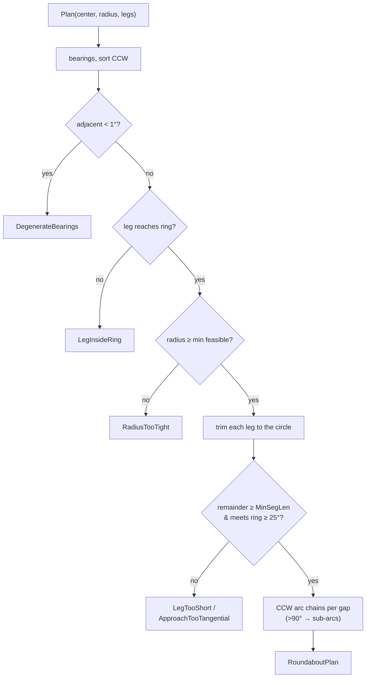

# Chapter 09 — Roundabouts

A roundabout in citybuilder is not a special primitive the simulation understands. It is a
**live entity layered on top of the ordinary road graph**: a circular one-way ring built
from the same `RoadEdge`/`RoadNode` records as any other road, whose circulating priority
falls out of the junction-control (ch. 03) and arbitration (ch. 05) machinery that already
existed. The entire feature is a geometry problem plus a bookkeeping problem — there is
**zero roundabout-specific code in the traffic simulation**. This chapter explains the two
halves: the pure `RoundaboutPlanner` that computes ring geometry, and the network-owned
registry that performs the graph surgery and keeps the ring consistent as the player keeps
editing.

The design follows CS2's workflow, not CS1's: you don't hand-assemble a ring from one-way
segments (which trips the sliver/sharp-leg guards of ch. 02 the moment an approach lands on
a ring segment). You build a normal intersection and **convert it in place**.

## At a glance

- **Sources:** `src/Domain/Network/RoundaboutPlanner.cs` (pure geometry),
  `src/Domain/Network/RoadNetwork.Roundabouts.cs` (registry + surgery, a partial of
  `RoadNetwork`), `src/Domain/Network/Roundabout.cs` (entity + result/error types),
  `RoundaboutId` in `Ids.cs`, the `RoadNode.Ring` tag in `Entities.cs`. Editor surface in
  `src/Game/JunctionPanel.cs`.
- **Key types:**
  - `Roundabout` (`Roundabout.cs`) — `Id`, `Center`, `Radius`, the CCW `RingNodes`/`RingEdges`
    lists, and `LegFullCurves` (each approach's pre-conversion curve, for lossless re-trim).
  - `RoundaboutPlanner.Plan(center, radius, legs) → RoundaboutPlan` — pure; ring slots, CCW
    arc chains, per-leg trims, or the first blocking `RoundaboutError`.
  - `RoadNode.Ring` — `RoundaboutId?`; non-null marks a ring node (slot or intermediate).
  - `RoundaboutResult` / `RoundaboutError` — outcome of a convert/edit; nothing mutates on failure.
- **Used by:** `JunctionPanel` (convert button + radius spinner for a plain junction; radius
  spinner + remove for a ring node), undo-checkpointed via the panel's `_beforeMutate` hook.
- **Depends on:** `Bezier3.Split` / arc-cubic construction ([ch. 01](01-geometry.md)); the
  `OneWay` catalog type ([ch. 02](02-network-validation.md)); `JunctionControl.Resolve` /
  `ConnectorBuilder` ([ch. 03](03-junctions-control.md)/[04](04-lane-graph-connectors.md))
  for the derived yield-on-entry control; `SaveGame` v2 ([ch. 08](08-persistence.md)).
- **Last verified against commit:** M7.5, 2026-07-17.

## The planner — pure ring geometry

`RoundaboutPlanner.Plan` takes the center point, a target radius, and the approach legs
(`ApproachLeg`: the leg's `EdgeId`, curve, whether it *ends* at the center, and its type),
and returns everything needed to build the ring, or a `RoundaboutError`. It never touches
the network.

Its steps, in order (the first failing check wins, no mutation):

1. **Leg reaches the ring.** A leg whose outer endpoint is within `radius` of the center
   can't be trimmed onto the circle → `LegInsideRing`.
2. **Trim — first crossing from the outer end.** Each leg is cut where its curve first
   crosses the circle, seen from the outer end: a marching pass brackets the first
   crossing, then bisection refines it. Distance-to-center is *not* monotonic along a
   committable leg — a hook shape can cross the radius three times, and a naive
   whole-span bisection converged to an inner crossing, leaving the trimmed leg piercing
   the ring (hardening find, counterexample pinned in `RoundaboutPlannerTests`). A
   trimmed remainder shorter than the leg type's `MinSegmentLength` → `LegTooShort`; a
   trimmed leg that still re-enters the circle anywhere → `LegInsideRing` (defense in
   depth).
3. **Slots sit at the actual crossing.** Each slot's bearing comes from the *cut point*
   (`atan2` of cut − center), **not** from the leg's tangent at the old center — for a
   curved leg those differ by degrees, and the tangent-bearing version bound approaches
   to ring nodes their curves missed by metres (drifting endpoints, ring arcs crossing
   the dangling curve — the fuzzer's find once the crossing invariant existed). The
   trimmed curve's inner endpoint is pinned exactly onto the slot position.
4. **Clean meeting angle.** The trimmed approach's direction where it meets the ring must
   clear `MinJunctionAngleDeg` (25°) from *both* ring-tangent directions at the slot, or
   the ring node would carry two legs closer than the junction floor →
   `ApproachTooTangential`.
5. **Degenerate crossings.** Slots are sorted CCW by crossing bearing; any two adjacent
   within 1° → `DegenerateBearings` (two approaches that can't get distinct ring slots).
6. **Feasibility.** Each gap between adjacent slots becomes one or more ring arcs; the
   smallest resulting sub-arc must clear `OneWay.MinSegmentLength` (12 m), else
   `RadiusTooTight`. (`MinFeasibleRadius` — a tangent-bearing *approximation*, since the
   exact crossings depend on the radius itself — feeds the inspector's spinner clamps via
   `RoadNetwork.ConversionMinRadius`/`RoundaboutMinRadius`; planner errors are still
   surfaced when the approximation is off for curved legs.)
7. **Ring arcs.** Each gap is built directly from its angular span as a chain of circular-arc
   cubics (`k = 4/3·tan(Δ/4)·R` per sub-arc), splitting any gap wider than 90° so no single
   cubic exceeds a quarter turn — a 3-leg ring routinely has a >180° gap, which is why the
   arcs are built from angles rather than via `BezierOps.ArcFromTangent` (that helper caps at
   a 175° sweep). Chain endpoints are pinned exactly onto the slot positions.

The registry adds one more gate the planner can't see: **`Obstructed`** — after a
successful plan, `ConvertToRoundabout`/`Regenerate` check every planned ring arc for
intersections with live edges the conversion won't consume (not a leg, not an old ring
edge) and refuse rather than stamp drivable geometry across a bystander road. This was
the M7.5 review's top finding: the original conversion bypassed `Validate` entirely and
`NetworkInvariants` had no crossing rule, so fuzz certification was structurally blind
to overlapping rings.

## Conversion and the registry

`ConvertToRoundabout(NodeId center, float radius) → RoundaboutResult`
(`RoadNetwork.Roundabouts.cs`) is the entry point. Preconditions, each an early failure with
no mutation: the node must exist and be degree ≥ 3 (`NotAJunction`), not already a ring node
(`AlreadyRoundabout`), and none of its legs may already belong to a roundabout (`ForeignLeg`).
It builds `ApproachLeg`s from the center's edges, runs the planner, and on success does all
of the following inside **one batch** (one `Changed` event):

- **Ring nodes** — one per slot, plus intermediate nodes at the internal boundaries of any
  multi-cubic arc chain; all tagged `Ring = id`.
- **Ring edges** — one `OneWay` edge per arc cubic, CCW, collected into the `RingEdges` list.
- **Leg trims in place** — each approach edge is replaced with its trimmed curve **keeping its
  `EdgeId`** (so `EdgeId`-keyed junction authoring survives, the ch. 02 / M7 philosophy),
  its inner end rebound from the center to its slot node. This is `TrimLegInto`, which takes
  the *current inner node* explicitly (not inferred from curve orientation — see Known limits
  for the bug that taught us why) and rebinds it, keeping the true outer node.
- **Center deletion** — the now-edgeless center node is removed.
- **Registration** — a `Roundabout` record is stored, capturing `LegFullCurves` (each leg's
  pre-trim curve, which reaches the center) so a later radius change re-trims from the
  original shape rather than compounding trims.

Yield-on-entry is **not** written into the ring nodes here. It is derived (next section).

**Radius, remove, dissolve.** `SetRoundaboutRadius(id, radius)` re-arcs from `LegFullCurves`
(lossless — repeated radius edits don't drift). `RemoveRoundabout(id)` tears the ring down,
leaving each approach as a clean free-ended stub. Both, plus the live-bulldoze path below,
share the internal `Regenerate`, which discovers the surviving approaches **structurally**
(any non-ring edge on a ring node), re-plans, and rebuilds — auto-**dissolving** when fewer
than 3 approaches remain (a 2-leg "roundabout" is just a bend).

**Live re-arc on bulldoze.** `RemoveEdge` marks any roundabout whose ring node the removed
edge touched as *dirty*, then drains the dirty set after its batch closes — each regenerate
runs in its own batch (re-entrancy guarded). Bulldoze an approach and the ring re-spaces to
the survivors; bulldoze a ring edge and the ring is rebuilt from the approaches (a repair).

## Yield-on-entry is derived, not stored

Circulating priority is the whole point, and it comes entirely from control resolution.
`RebuildDerived` special-cases a ring node: instead of pruning stored overrides, it computes
`RingNodeConfig` fresh every rebuild — `PrioritySigns` mode, every leg to *another ring node
of the same roundabout* marked `Main` (circulating), every approach marked `Yield`.
`ConnectorBuilder` (ch. 04) then stamps `RightOfWay.Yield` on entry connectors and
`RightOfWay.Free` on circulating connectors, and the M5 arbiter does the rest: entering
vehicles accept a gap, circulating vehicles have priority, the merge onto each outbound ring
edge is arbitrated like any other.

Deriving this — rather than storing per-approach `RoleOverrides` at conversion time — is what
makes the ring robust to approach churn. An approach's `EdgeId` can change under a split or
heal; a stored override keyed by the old id would strand. Because the role is recomputed from
ring membership whenever the node is touched (and any edit that changes an approach touches
its ring node), yield-on-entry can never fall out of sync. This replaced an earlier
stored-config version that the fuzzer broke within a few hundred actions.

## The immutability model

A roundabout's ring nodes, ring edges, and approach edges are **owned by the roundabout** and
immutable except through bulldoze and the roundabout API. This is the v1 boundary — editing a
live ring's approaches (splitting one, drawing a new road into the ring) is a deferred
feature — and it is enforced at every mutation entry point, **at both phases** of the
Validate/Commit contract (the hardening pass closed the snapshot-vs-live gap):

- `ConfigureJunction` on a ring node is ignored (its control is derived).
- `RetypeEdge` on a ring edge returns `RetypeError.Locked`; `FlipEdge` returns false.
  **Approaches stay retypable and flippable** — they're the player's roads; a flip also
  reverses the roundabout's captured full curve (`OnApproachFlipped`) so regeneration
  preserves the flip instead of silently reverting a one-way.
- `Validate` adds `PlacementError.TouchesRoundabout` to any proposal whose endpoints
  would attach to a ring node or split an owned edge, or whose curve crosses one —
  detected inside Validate's own intersection loop (no separate scan), with an early-out
  when no roundabouts exist.
- **Commit-side**: `CommitCurve` drops any curve whose *live* crossing lands on an owned
  edge (reuse absorption can relocate endpoints past what Validate's snapshot exempted),
  and `ResolveBinding` never splits an owned edge or reuses a ring node — the fallback
  paths create a fresh node instead.
- `TryHealNode` refuses to merge two edges when either far node is a ring node (the merged
  edge would be a roundabout approach with a fresh, untracked `EdgeId`).
- The Bulldoze **tool** refuses ring edges outright (a lone ring-edge removal would just
  regenerate an identical ring while despawning its traffic — a costly no-op); if a ring
  edge is removed programmatically anyway, the dirty-drain repairs the ring, and a failed
  re-plan falls back to `Dissolve` so the registry never points at missing geometry.

The upshot: approach `EdgeId`s are stable, so `LegFullCurves` stays valid, so regeneration is
always trimming from real geometry. The one deliberate consequence a player feels is that you
can't yet draw a fresh road into an existing ring — build all the approaches first, then
convert.

## Persistence (format v2)

Save format v2 (ch. 08) adds a `RoundaboutDto[]` and a `NextRoundabout` counter. Ring nodes
and edges already serialize as ordinary node/edge DTOs; the roundabout DTO stores only its
identity, center, radius, the CCW ring node/edge id lists, and the per-leg full curves.
`RestoreInto` rebuilds the registry and re-tags the ring nodes; `ValidateGame` bounds the ids
and references. Format-v1 saves (no roundabout field) load unchanged as networks with no
roundabouts, and the byte-stable round-trip contract extends to cover roundabouts.

## Invariants

Checked by `NetworkInvariants.CheckRoundabouts` after every fuzz action and by every
roundabout test:

- Every ring edge is `OneWay`, both ends ring nodes of the same roundabout.
- Ring edges form one closed cycle: `RingEdges.Count == RingNodes.Count`, each ring node has
  exactly two ring legs.
- A ring node carries 0 or 1 approach; a node carrying one resolves its approach to `Yield`
  under `PrioritySigns`.
- Every `RoadNode.Ring` maps to a registered roundabout that lists the node (no orphan tags).
- The produced graph satisfies all ch. 02 invariants (no slivers, no sub-25° legs) — the
  planner's floor and meeting-angle checks guarantee it.

## Tuning constants

| Constant | Value | Where | Rationale |
|---|---|---|---|
| Degenerate-bearing floor | 1° | `RoundaboutPlanner` | Two approaches closer than this can't get distinct slots. |
| Sub-arc cap | 90° (π/2) | `RoundaboutPlanner.ArcChain` | Keeps each ring cubic within a quarter turn for good circular fidelity; wider gaps split with intermediate ring nodes. |
| Approach meeting-angle floor | 25° (`MinJunctionAngleDeg`) | `RoundaboutPlanner.MeetsRingCleanly` | An approach nearer the ring tangent would make a sharp leg at the ring node. |
| Ring type | `OneWay` (12 m, MinSegLen 12, MinRadius 10) | catalog | Every ring; circulation is CCW (right-hand traffic). |
| Auto-dissolve threshold | < 3 approaches | `Regenerate` | A 2-leg ring is a bend, not a roundabout. |
| Default editor radius | 20 m | `JunctionPanel` | Spinner minimum is clamped to the planner's feasible minimum. |

## Known limits

- **Drawing a new road into an existing ring is not supported (deferred).** The immutability
  model refuses it (`TouchesRoundabout`) rather than corrupting the ring. Change the approach
  set by bulldozing (re-arcs) or remove-and-reconvert. This is the single biggest deferral.
- **Radius shrink past an untracked approach can straighten it.** Regeneration synthesizes a
  radial full curve for any approach it discovers without a tracked `LegFullCurve` (only
  reachable if the commit-side ownership guards were somehow bypassed); at a different radius
  that approach re-trims as a straight stub. Not reachable through the normal editor.
- **`MinFeasibleRadius` is a tangent-bearing approximation.** The spinner clamps derived from
  it can still admit a radius the planner refuses for strongly curved legs (slot crossings
  move with the radius); the panel surfaces the error and reverts. Exact feasibility would
  require iterating plan attempts.
- **Radius edits re-key ring node/edge ids.** The inspector now hands its selection to the
  nearest successor ring node, so the panel survives the edit; external references to old
  ring ids (if any are ever added) would still go stale.
- **In-flight vehicles are not preserved across conversion or regeneration** — they resync
  as after a quickload, consistent with M7 undo. Ambient traffic respawns.
- **A dissolved roundabout leaves nearby degree-2 nodes unhealed.** `TryHealNode` runs only
  at removal time; a heal it refused while the ring existed (far node was a ring node) is
  not retried when the roundabout is later removed — the leftover bend node is cosmetic and
  heals on the next bulldoze touching it. Same standing behavior as retype/flip refusals.

### Hardening pass (2026-07-18, post-review)

An adversarial review of the original M7.5 ship found the conversion path trusted itself
instead of the network's gatekeepers. The fixes, all regression-pinned: the **no-crossing
invariant** (`CheckEdgeCrossings` — the checker was structurally blind to overlapping
geometry, which is how a broken conversion passed 3×10k fuzz), the **`Obstructed`** gate,
**first-crossing trim**, **slots at actual crossings**, **commit-side ownership guards**,
**flip capture**, save-format **membership uniqueness** validation, and the panel
**selection-successor** flow. The crossing invariant itself needed two refinements the
fuzzer taught it: coincidence-check `Intersections` hits (it emits garbage parameters for
near-collinear chain contacts) and exempt sub-5° grazing contact between legal G1
tangent-continuation pairs.

## How to verify

- `dotnet test` — `tests/Domain.Tests/Network/RoundaboutPlannerTests.cs` (pure geometry),
  `RoundaboutTests.cs` (convert/radius/remove/dissolve/bulldoze + the immutability rules),
  `tests/Domain.Tests/Traffic/RoundaboutTrafficTests.cs` (yield-on-entry resolves; a burst is
  drivable and collision-free), and the roundabout cases in `NetworkInvariantsTests.cs` and
  `SaveLoadTests.cs`.
- **The fuzzer** (`GestureFuzzer`) now converts, adjusts radius, and removes roundabouts as
  part of its alphabet, asserting `NetworkInvariants.Check` stays empty after every action —
  it is what drove out the derived-control and immutability rules above. Certified 3 × 10k.
- **KPI**: `RoundaboutThroughput` in `KpiScenarios` characterises a converted 4-way under
  ambient load (`docs/health/M7.5.md`).
- `CITYBUILDER_SMOKE=1 godot --headless .` builds an isolated 4-way, converts it, re-arcs it
  by bulldozing an approach, and undoes back — all with clean mesh rebuilds.
